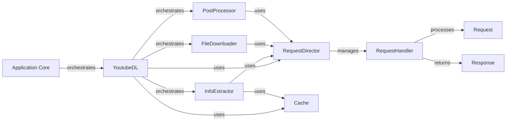

## Component Details

This graph illustrates the core components of the yt-dlp application, focusing on the high-level control flow, information extraction, file downloading, and post-processing. The `Application Core` serves as the primary entry point, orchestrating the `YoutubeDL` component. `YoutubeDL` acts as the central manager, coordinating `InfoExtractor` for metadata retrieval, `FileDownloader` for media acquisition, and `PostProcessor` for post-download operations. Network communication is handled by the `RequestDirector`, which dispatches `Request` objects to appropriate `RequestHandler` instances, receiving `Response` objects in return. A `Cache` component is utilized for performance optimization by storing frequently accessed data.

### Application Core
The primary entry point and high-level control flow of the yt-dlp application. It orchestrates the entire download process, including parsing global options, initiating information extraction, managing file downloading, applying post-processors, and handling overall application lifecycle and error reporting.

**Related Classes/Methods**:

- <a href="https://github.com/yt-dlp/yt-dlp/blob/master/yt_dlp/__main__.py#L1-L13" target="_blank" rel="noopener noreferrer">`yt_dlp.__main__` (1:13)</a>

### YoutubeDL
The central orchestrator of yt-dlp, responsible for managing the entire video download lifecycle. It initializes and coordinates information extractors, file downloaders, and post-processors, handles options, logging, progress reporting, and file system operations like naming, moving, and archiving downloaded content.

**Related Classes/Methods**:

- <a href="https://github.com/yt-dlp/yt-dlp/blob/master/yt_dlp/YoutubeDL.py#L195-L4447" target="_blank" rel="noopener noreferrer">`yt_dlp.YoutubeDL` (195:4447)</a>
- <a href="https://github.com/yt-dlp/yt-dlp/blob/master/yt_dlp/YoutubeDL.py#L1607-L1655" target="_blank" rel="noopener noreferrer">`yt_dlp.YoutubeDL:extract_info` (1607:1655)</a>
- <a href="https://github.com/yt-dlp/yt-dlp/blob/master/yt_dlp/YoutubeDL.py#L3632-L3646" target="_blank" rel="noopener noreferrer">`yt_dlp.YoutubeDL:download` (3632:3646)</a>

### InfoExtractor
An abstract base class that defines the interface for all site-specific information extractors. Its primary responsibility is to parse a given URL and extract comprehensive metadata about the video(s) it refers to, including formats, subtitles, and other relevant details. It also handles login procedures and geo-restriction bypass mechanisms.

**Related Classes/Methods**:

- <a href="https://github.com/yt-dlp/yt-dlp/blob/master/yt_dlp/extractor/common.py#L106-L4002" target="_blank" rel="noopener noreferrer">`yt_dlp.extractor.common.InfoExtractor` (106:4002)</a>

### FileDownloader
An abstract base class for components responsible for downloading the actual media content. It manages the download process, including progress reporting, handling temporary files, and retrying failed downloads due to network or file access issues.

**Related Classes/Methods**:

- <a href="https://github.com/yt-dlp/yt-dlp/blob/master/yt_dlp/downloader/common.py#L37-L497" target="_blank" rel="noopener noreferrer">`yt_dlp.downloader.common.FileDownloader` (37:497)</a>

### PostProcessor
An abstract base class for components that perform various operations on downloaded media files after the initial download is complete. These operations can include merging audio and video streams, embedding metadata like thumbnails, or converting file formats.

**Related Classes/Methods**:

- <a href="https://github.com/yt-dlp/yt-dlp/blob/master/yt_dlp/postprocessor/common.py#L36-L211" target="_blank" rel="noopener noreferrer">`yt_dlp.postprocessor.common.PostProcessor` (36:211)</a>

### RequestDirector
A centralized component responsible for managing and dispatching all outgoing network requests. It selects the most suitable RequestHandler based on the request's properties and a set of registered preferences, ensuring efficient and appropriate network communication.

**Related Classes/Methods**:

- <a href="https://github.com/yt-dlp/yt-dlp/blob/master/yt_dlp/networking/common.py#L51-L130" target="_blank" rel="noopener noreferrer">`yt_dlp.networking.common.RequestDirector` (51:130)</a>

### RequestHandler
An abstract base class for implementing specific network request handling logic. Subclasses of RequestHandler (e.g., for urllib, requests, or curl_cffi) manage the details of sending HTTP requests, handling SSL certificates, proxies, and cookies.

**Related Classes/Methods**:

- <a href="https://github.com/yt-dlp/yt-dlp/blob/master/yt_dlp/networking/common.py#L149-L382" target="_blank" rel="noopener noreferrer">`yt_dlp.networking.common.RequestHandler` (149:382)</a>

### Request
A data structure that encapsulates all information related to an outgoing network request, including the URL, HTTP headers, payload data, request method (GET, POST, etc.), proxy settings, and any handler-specific extensions.

**Related Classes/Methods**:

- <a href="https://github.com/yt-dlp/yt-dlp/blob/master/yt_dlp/networking/common.py#L385-L504" target="_blank" rel="noopener noreferrer">`yt_dlp.networking.common.Request` (385:504)</a>

### Response
A data structure representing an incoming network response. It provides access to the response content (as a file-like object), the final URL, HTTP headers, status code, and a reason phrase.

**Related Classes/Methods**:

- <a href="https://github.com/yt-dlp/yt-dlp/blob/master/yt_dlp/networking/common.py#L512-L597" target="_blank" rel="noopener noreferrer">`yt_dlp.networking.common.Response` (512:597)</a>

### Cache
A component responsible for storing and retrieving cached data. It helps improve performance by reducing the need for redundant network requests and re-extraction of information.

**Related Classes/Methods**:

- <a href="https://github.com/yt-dlp/yt-dlp/blob/master/yt_dlp/cache.py#L13-L91" target="_blank" rel="noopener noreferrer">`yt_dlp.cache.Cache` (13:91)</a>

### [FAQ](https://github.com/CodeBoarding/GeneratedOnBoardings/tree/main?tab=readme-ov-file#faq)