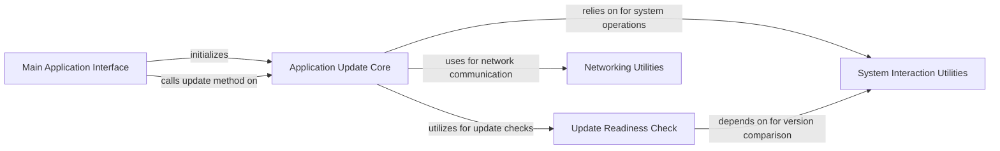

## Component Details

This graph describes the 'Application Update' subsystem of yt-dlp. The main flow involves the 'Main Application Interface' initiating the update process through the 'Application Update Core'. The 'Application Update Core' then orchestrates the update by utilizing the 'Update Readiness Check' to determine update eligibility, 'Networking Utilities' for communication with update servers, and 'System Interaction Utilities' for file operations and system information. The 'Update Readiness Check' also depends on 'System Interaction Utilities' for version comparisons.

### Application Update Core
This component encapsulates the primary logic for managing the self-update mechanism of the yt-dlp application. It orchestrates the entire update process, from checking for new versions to replacing the executable.

**Related Classes/Methods**:

- <a href="https://github.com/yt-dlp/yt-dlp/blob/master/yt_dlp/update.py#L209-L570" target="_blank" rel="noopener noreferrer">`yt_dlp.update.Updater` (209:570)</a>
- <a href="https://github.com/yt-dlp/yt-dlp/blob/master/yt_dlp/update.py#L439-L523" target="_blank" rel="noopener noreferrer">`yt_dlp.update.Updater:update` (439:523)</a>
- <a href="https://github.com/yt-dlp/yt-dlp/blob/master/yt_dlp/update.py#L359-L437" target="_blank" rel="noopener noreferrer">`yt_dlp.update.Updater:query_update` (359:437)</a>
- <a href="https://github.com/yt-dlp/yt-dlp/blob/master/yt_dlp/update.py#L282-L303" target="_blank" rel="noopener noreferrer">`yt_dlp.update.Updater:_get_version_info` (282:303)</a>
- <a href="https://github.com/yt-dlp/yt-dlp/blob/master/yt_dlp/update.py#L305-L317" target="_blank" rel="noopener noreferrer">`yt_dlp.update.Updater:_download_update_spec` (305:317)</a>
- <a href="https://github.com/yt-dlp/yt-dlp/blob/master/yt_dlp/update.py#L319-L347" target="_blank" rel="noopener noreferrer">`yt_dlp.update.Updater:_process_update_spec` (319:347)</a>
- <a href="https://github.com/yt-dlp/yt-dlp/blob/master/yt_dlp/update.py#L349-L357" target="_blank" rel="noopener noreferrer">`yt_dlp.update.Updater:_version_compare` (349:357)</a>
- <a href="https://github.com/yt-dlp/yt-dlp/blob/master/yt_dlp/update.py#L272-L280" target="_blank" rel="noopener noreferrer">`yt_dlp.update.Updater:_call_api` (272:280)</a>
- <a href="https://github.com/yt-dlp/yt-dlp/blob/master/yt_dlp/update.py#L263-L270" target="_blank" rel="noopener noreferrer">`yt_dlp.update.Updater:_download_asset` (263:270)</a>
- <a href="https://github.com/yt-dlp/yt-dlp/blob/master/yt_dlp/update.py#L557-L559" target="_blank" rel="noopener noreferrer">`yt_dlp.update.Updater:_report_error` (557:559)</a>
- <a href="https://github.com/yt-dlp/yt-dlp/blob/master/yt_dlp/update.py#L564-L570" target="_blank" rel="noopener noreferrer">`yt_dlp.update.Updater:_report_network_error` (564:570)</a>
- <a href="https://github.com/yt-dlp/yt-dlp/blob/master/yt_dlp/update.py#L561-L562" target="_blank" rel="noopener noreferrer">`yt_dlp.update.Updater:_report_permission_error` (561:562)</a>
- <a href="https://github.com/yt-dlp/yt-dlp/blob/master/yt_dlp/update.py#L551-L555" target="_blank" rel="noopener noreferrer">`yt_dlp.update.Updater:_block_restart` (551:555)</a>
- <a href="https://github.com/yt-dlp/yt-dlp/blob/master/yt_dlp/update.py#L215-L251" target="_blank" rel="noopener noreferrer">`yt_dlp.update.Updater.__init__` (215:251)</a>
- <a href="https://github.com/yt-dlp/yt-dlp/blob/master/yt_dlp/update.py#L526-L528" target="_blank" rel="noopener noreferrer">`yt_dlp.update.Updater.filename` (526:528)</a>
- <a href="https://github.com/yt-dlp/yt-dlp/blob/master/yt_dlp/update.py#L544-L549" target="_blank" rel="noopener noreferrer">`yt_dlp.update.Updater.restart` (544:549)</a>

### Update Readiness Check
This component is responsible for determining the current installation's variant and whether it is eligible for automatic updates.

**Related Classes/Methods**:

- <a href="https://github.com/yt-dlp/yt-dlp/blob/master/yt_dlp/update.py#L91-L92" target="_blank" rel="noopener noreferrer">`yt_dlp.update.detect_variant` (91:92)</a>
- <a href="https://github.com/yt-dlp/yt-dlp/blob/master/yt_dlp/update.py#L130-L134" target="_blank" rel="noopener noreferrer">`yt_dlp.update.is_non_updateable` (130:134)</a>
- <a href="https://github.com/yt-dlp/yt-dlp/blob/master/yt_dlp/update.py#L56-L88" target="_blank" rel="noopener noreferrer">`yt_dlp.update._get_variant_and_executable_path` (56:88)</a>
- <a href="https://github.com/yt-dlp/yt-dlp/blob/master/yt_dlp/update.py#L137-L138" target="_blank" rel="noopener noreferrer">`yt_dlp.update._get_binary_name` (137:138)</a>

### Networking Utilities
This component provides core functionalities for making HTTP requests and handling network-related operations, essential for communicating with update servers.

**Related Classes/Methods**:

- <a href="https://github.com/yt-dlp/yt-dlp/blob/master/yt_dlp/networking/common.py#L385-L504" target="_blank" rel="noopener noreferrer">`yt_dlp.networking.common.Request` (385:504)</a>
- <a href="https://github.com/yt-dlp/yt-dlp/blob/master/yt_dlp/networking/common.py#L149-L382" target="_blank" rel="noopener noreferrer">`yt_dlp.networking.common.RequestHandler` (149:382)</a>
- <a href="https://github.com/yt-dlp/yt-dlp/blob/master/yt_dlp/networking/common.py#L512-L597" target="_blank" rel="noopener noreferrer">`yt_dlp.networking.common.Response` (512:597)</a>

### System Interaction Utilities
This component offers various utility functions for interacting with the operating system, including file operations, process execution, and system information retrieval.

**Related Classes/Methods**:

- `yt_dlp.utils._utils._sha256_file` (full file reference)
- <a href="https://github.com/yt-dlp/yt-dlp/blob/master/yt_dlp/utils/_utils.py#L908-L912" target="_blank" rel="noopener noreferrer">`yt_dlp.utils._utils.Popen.run` (908:912)</a>
- <a href="https://github.com/yt-dlp/yt-dlp/blob/master/yt_dlp/utils/_utils.py#L1686-L1696" target="_blank" rel="noopener noreferrer">`yt_dlp.utils._utils.shell_quote` (1686:1696)</a>
- <a href="https://github.com/yt-dlp/yt-dlp/blob/master/yt_dlp/utils/_utils.py#L1439-L1455" target="_blank" rel="noopener noreferrer">`yt_dlp.utils._utils.system_identifier` (1439:1455)</a>
- <a href="https://github.com/yt-dlp/yt-dlp/blob/master/yt_dlp/utils/_utils.py#L1950-L1951" target="_blank" rel="noopener noreferrer">`yt_dlp.utils._utils.remove_end` (1950:1951)</a>
- <a href="https://github.com/yt-dlp/yt-dlp/blob/master/yt_dlp/utils/_utils.py#L4662-L4666" target="_blank" rel="noopener noreferrer">`yt_dlp.utils._utils.format_field` (4662:4666)</a>
- <a href="https://github.com/yt-dlp/yt-dlp/blob/master/yt_dlp/utils/_utils.py#L2890-L2891" target="_blank" rel="noopener noreferrer">`yt_dlp.utils._utils.version_tuple` (2890:2891)</a>
- `yt_dlp.utils._utils._make_label` (full file reference)
- <a href="https://github.com/yt-dlp/yt-dlp/blob/master/yt_dlp/utils/_utils.py#L956-L965" target="_blank" rel="noopener noreferrer">`yt_dlp.utils._utils.YoutubeDLError` (956:965)</a>
- <a href="https://github.com/yt-dlp/yt-dlp/blob/master/yt_dlp/utils/_utils.py#L968-L1009" target="_blank" rel="noopener noreferrer">`yt_dlp.utils._utils.ExtractorError` (968:1009)</a>
- <a href="https://github.com/yt-dlp/yt-dlp/blob/master/yt_dlp/utils/_utils.py#L1082-L1087" target="_blank" rel="noopener noreferrer">`yt_dlp.utils._utils.PostProcessingError` (1082:1087)</a>

### Main Application Interface
This component represents the primary entry point and overall control of the yt-dlp application, which initiates and manages the update subsystem.

**Related Classes/Methods**:

- <a href="https://github.com/yt-dlp/yt-dlp/blob/master/yt_dlp/YoutubeDL.py#L195-L4447" target="_blank" rel="noopener noreferrer">`yt_dlp.YoutubeDL` (195:4447)</a>
- <a href="https://github.com/yt-dlp/yt-dlp/blob/master/yt_dlp/update.py#L573-L580" target="_blank" rel="noopener noreferrer">`yt_dlp.update.run_update` (573:580)</a>

### [FAQ](https://github.com/CodeBoarding/GeneratedOnBoardings/tree/main?tab=readme-ov-file#faq)