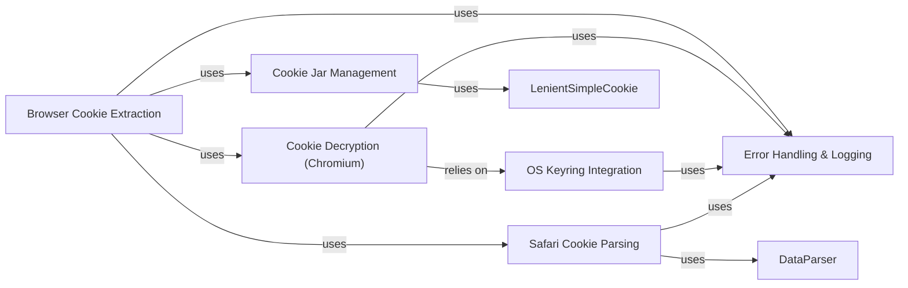

## Component Details

The Authentication & Session Management subsystem in yt-dlp is responsible for handling user login sessions and maintaining persistent cookie data. It achieves this by providing functionalities to load and save cookies from various sources, including Netscape-formatted cookie files and web browsers like Firefox, Safari, and Chromium-based browsers. A central aspect of this subsystem is its ability to decrypt browser-specific encrypted cookies, leveraging platform-dependent decryption methods and integrating with operating system keyrings for secure key retrieval. It also includes robust error handling and logging mechanisms to ensure reliable operation during cookie management.

### Cookie Jar Management
Manages the loading, saving, and manipulation of HTTP cookies, primarily using a custom `YoutubeDLCookieJar` that extends `http.cookiejar.MozillaCookieJar` for compatibility with Netscape cookie files and session cookie handling.

**Related Classes/Methods**:

- <a href="https://github.com/yt-dlp/yt-dlp/blob/master/yt_dlp/cookies.py#L1242-L1386" target="_blank" rel="noopener noreferrer">`yt_dlp.cookies.YoutubeDLCookieJar` (1242:1386)</a>
- <a href="https://github.com/yt-dlp/yt-dlp/blob/master/yt_dlp/cookies.py#L1320-L1369" target="_blank" rel="noopener noreferrer">`yt_dlp.cookies.YoutubeDLCookieJar.load` (1320:1369)</a>
- <a href="https://github.com/yt-dlp/yt-dlp/blob/master/yt_dlp/cookies.py#L1299-L1318" target="_blank" rel="noopener noreferrer">`yt_dlp.cookies.YoutubeDLCookieJar.save` (1299:1318)</a>
- <a href="https://github.com/yt-dlp/yt-dlp/blob/master/yt_dlp/cookies.py#L1371-L1375" target="_blank" rel="noopener noreferrer">`yt_dlp.cookies.YoutubeDLCookieJar.get_cookie_header` (1371:1375)</a>
- <a href="https://github.com/yt-dlp/yt-dlp/blob/master/yt_dlp/cookies.py#L1377-L1382" target="_blank" rel="noopener noreferrer">`yt_dlp.cookies.YoutubeDLCookieJar.get_cookies_for_url` (1377:1382)</a>
- <a href="https://github.com/yt-dlp/yt-dlp/blob/master/yt_dlp/cookies.py#L1151-L1239" target="_blank" rel="noopener noreferrer">`yt_dlp.cookies.LenientSimpleCookie` (1151:1239)</a>

### Browser Cookie Extraction
Provides the core logic for extracting cookies from various web browsers (Firefox, Safari, Chromium-based browsers) by locating their respective cookie databases and parsing their contents.

**Related Classes/Methods**:

- <a href="https://github.com/yt-dlp/yt-dlp/blob/master/yt_dlp/cookies.py#L93-L113" target="_blank" rel="noopener noreferrer">`yt_dlp.cookies.load_cookies` (93:113)</a>
- <a href="https://github.com/yt-dlp/yt-dlp/blob/master/yt_dlp/cookies.py#L116-L124" target="_blank" rel="noopener noreferrer">`yt_dlp.cookies.extract_cookies_from_browser` (116:124)</a>
- <a href="https://github.com/yt-dlp/yt-dlp/blob/master/yt_dlp/cookies.py#L127-L193" target="_blank" rel="noopener noreferrer">`yt_dlp.cookies._extract_firefox_cookies` (127:193)</a>
- <a href="https://github.com/yt-dlp/yt-dlp/blob/master/yt_dlp/cookies.py#L554-L577" target="_blank" rel="noopener noreferrer">`yt_dlp.cookies._extract_safari_cookies` (554:577)</a>
- <a href="https://github.com/yt-dlp/yt-dlp/blob/master/yt_dlp/cookies.py#L280-L355" target="_blank" rel="noopener noreferrer">`yt_dlp.cookies._extract_chrome_cookies` (280:355)</a>

### Cookie Decryption (Chromium)
Handles the decryption of encrypted cookies from Chromium-based browsers, employing platform-specific decryption mechanisms (AES-CBC, AES-GCM, DPAPI) and interacting with OS keyrings or local state files to retrieve decryption keys.

**Related Classes/Methods**:

- <a href="https://github.com/yt-dlp/yt-dlp/blob/master/yt_dlp/cookies.py#L382-L413" target="_blank" rel="noopener noreferrer">`yt_dlp.cookies.ChromeCookieDecryptor` (382:413)</a>
- <a href="https://github.com/yt-dlp/yt-dlp/blob/master/yt_dlp/cookies.py#L424-L477" target="_blank" rel="noopener noreferrer">`yt_dlp.cookies.LinuxChromeCookieDecryptor` (424:477)</a>
- <a href="https://github.com/yt-dlp/yt-dlp/blob/master/yt_dlp/cookies.py#L480-L511" target="_blank" rel="noopener noreferrer">`yt_dlp.cookies.MacChromeCookieDecryptor` (480:511)</a>
- <a href="https://github.com/yt-dlp/yt-dlp/blob/master/yt_dlp/cookies.py#L514-L551" target="_blank" rel="noopener noreferrer">`yt_dlp.cookies.WindowsChromeCookieDecryptor` (514:551)</a>
- <a href="https://github.com/yt-dlp/yt-dlp/blob/master/yt_dlp/cookies.py#L416-L421" target="_blank" rel="noopener noreferrer">`yt_dlp.cookies.get_cookie_decryptor` (416:421)</a>
- <a href="https://github.com/yt-dlp/yt-dlp/blob/master/yt_dlp/cookies.py#L358-L379" target="_blank" rel="noopener noreferrer">`yt_dlp.cookies._process_chrome_cookie` (358:379)</a>
- <a href="https://github.com/yt-dlp/yt-dlp/blob/master/yt_dlp/cookies.py#L1026-L1027" target="_blank" rel="noopener noreferrer">`yt_dlp.cookies.pbkdf2_sha1` (1026:1027)</a>
- <a href="https://github.com/yt-dlp/yt-dlp/blob/master/yt_dlp/cookies.py#L1030-L1040" target="_blank" rel="noopener noreferrer">`yt_dlp.cookies._decrypt_aes_cbc_multi` (1030:1040)</a>
- <a href="https://github.com/yt-dlp/yt-dlp/blob/master/yt_dlp/cookies.py#L1043-L1056" target="_blank" rel="noopener noreferrer">`yt_dlp.cookies._decrypt_aes_gcm` (1043:1056)</a>
- <a href="https://github.com/yt-dlp/yt-dlp/blob/master/yt_dlp/cookies.py#L1059-L1091" target="_blank" rel="noopener noreferrer">`yt_dlp.cookies._decrypt_windows_dpapi` (1059:1091)</a>

### OS Keyring Integration
Interfaces with the operating system's keyring or credential storage mechanisms (e.g., KWallet, Gnome Keyring, macOS Keychain, Windows DPAPI) to securely retrieve passwords or encryption keys required for decrypting browser cookies.

**Related Classes/Methods**:

- <a href="https://github.com/yt-dlp/yt-dlp/blob/master/yt_dlp/cookies.py#L961-L978" target="_blank" rel="noopener noreferrer">`yt_dlp.cookies._get_linux_keyring_password` (961:978)</a>
- <a href="https://github.com/yt-dlp/yt-dlp/blob/master/yt_dlp/cookies.py#L981-L996" target="_blank" rel="noopener noreferrer">`yt_dlp.cookies._get_mac_keyring_password` (981:996)</a>
- <a href="https://github.com/yt-dlp/yt-dlp/blob/master/yt_dlp/cookies.py#L999-L1023" target="_blank" rel="noopener noreferrer">`yt_dlp.cookies._get_windows_v10_key` (999:1023)</a>
- <a href="https://github.com/yt-dlp/yt-dlp/blob/master/yt_dlp/cookies.py#L831-L857" target="_blank" rel="noopener noreferrer">`yt_dlp.cookies._choose_linux_keyring` (831:857)</a>
- <a href="https://github.com/yt-dlp/yt-dlp/blob/master/yt_dlp/cookies.py#L901-L941" target="_blank" rel="noopener noreferrer">`yt_dlp.cookies._get_kwallet_password` (901:941)</a>
- <a href="https://github.com/yt-dlp/yt-dlp/blob/master/yt_dlp/cookies.py#L944-L958" target="_blank" rel="noopener noreferrer">`yt_dlp.cookies._get_gnome_keyring_password` (944:958)</a>

### Safari Cookie Parsing
Specifically designed to parse the proprietary binary cookie format used by Safari, extracting cookie data and converting it into a standard cookie jar format.

**Related Classes/Methods**:

- <a href="https://github.com/yt-dlp/yt-dlp/blob/master/yt_dlp/cookies.py#L709-L723" target="_blank" rel="noopener noreferrer">`yt_dlp.cookies.parse_safari_cookies` (709:723)</a>
- <a href="https://github.com/yt-dlp/yt-dlp/blob/master/yt_dlp/cookies.py#L584-L632" target="_blank" rel="noopener noreferrer">`yt_dlp.cookies.DataParser` (584:632)</a>
- <a href="https://github.com/yt-dlp/yt-dlp/blob/master/yt_dlp/cookies.py#L639-L644" target="_blank" rel="noopener noreferrer">`yt_dlp.cookies._parse_safari_cookies_header` (639:644)</a>
- <a href="https://github.com/yt-dlp/yt-dlp/blob/master/yt_dlp/cookies.py#L647-L664" target="_blank" rel="noopener noreferrer">`yt_dlp.cookies._parse_safari_cookies_page` (647:664)</a>
- <a href="https://github.com/yt-dlp/yt-dlp/blob/master/yt_dlp/cookies.py#L667-L706" target="_blank" rel="noopener noreferrer">`yt_dlp.cookies._parse_safari_cookies_record` (667:706)</a>

### Error Handling & Logging
Provides custom error types and logging utilities specifically for cookie-related operations, ensuring consistent error reporting and progress indication during cookie loading and extraction.

**Related Classes/Methods**:

- <a href="https://github.com/yt-dlp/yt-dlp/blob/master/yt_dlp/cookies.py#L89-L90" target="_blank" rel="noopener noreferrer">`yt_dlp.cookies.CookieLoadError` (89:90)</a>
- <a href="https://github.com/yt-dlp/yt-dlp/blob/master/yt_dlp/cookies.py#L53-L76" target="_blank" rel="noopener noreferrer">`yt_dlp.cookies.YDLLogger` (53:76)</a>
- <a href="https://github.com/yt-dlp/yt-dlp/blob/master/yt_dlp/cookies.py#L79-L86" target="_blank" rel="noopener noreferrer">`yt_dlp.cookies._create_progress_bar` (79:86)</a>

### [FAQ](https://github.com/CodeBoarding/GeneratedOnBoardings/tree/main?tab=readme-ov-file#faq)