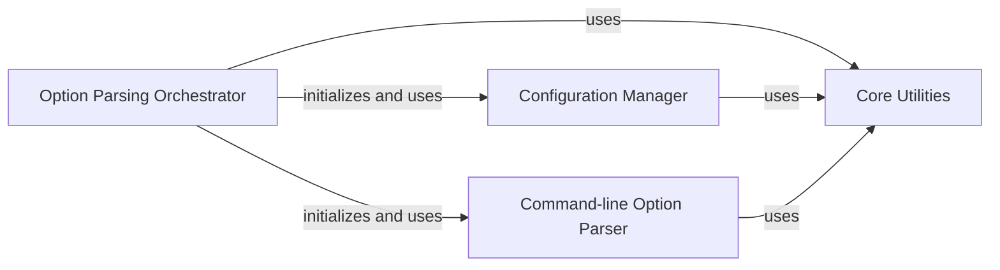

## Component Details

This component overview details the Configuration Management subsystem of yt-dlp. It focuses on how command-line arguments are parsed, configuration files are loaded and merged, and application-wide settings are managed. The core flow involves an orchestrator that initializes and utilizes a dedicated option parser and a configuration manager. These components, in turn, rely on a set of core utilities for various common tasks like file system operations, string manipulation, and error handling. The system ensures that configurations from different sources (command-line, portable, user, system) are processed in a defined hierarchy, with robust error handling and verbose debugging capabilities.

### Option Parsing Orchestrator
This component is the primary entry point for handling command-line arguments and loading configuration files. It initializes the configuration management system and the option parser, then proceeds to load and process arguments from various sources, including command-line overrides, portable configurations, user-specific settings, and system-wide configurations. It also manages error handling during the parsing process and controls the output of verbose debug information.

**Related Classes/Methods**:

- <a href="https://github.com/yt-dlp/yt-dlp/blob/master/yt_dlp/options.py#L43-L131" target="_blank" rel="noopener noreferrer">`yt_dlp.options:parseOpts` (43:131)</a>
- <a href="https://github.com/yt-dlp/yt-dlp/blob/master/yt_dlp/options.py#L50-L54" target="_blank" rel="noopener noreferrer">`yt_dlp.options.parseOpts.read_config` (50:54)</a>
- <a href="https://github.com/yt-dlp/yt-dlp/blob/master/yt_dlp/options.py#L56-L65" target="_blank" rel="noopener noreferrer">`yt_dlp.options.parseOpts._load_from_config_dirs` (56:65)</a>
- <a href="https://github.com/yt-dlp/yt-dlp/blob/master/yt_dlp/options.py#L67-L80" target="_blank" rel="noopener noreferrer">`yt_dlp.options.parseOpts.add_config` (67:80)</a>
- <a href="https://github.com/yt-dlp/yt-dlp/blob/master/yt_dlp/options.py#L82-L87" target="_blank" rel="noopener noreferrer">`yt_dlp.options.parseOpts.load_configs` (82:87)</a>

### Configuration Manager
The Configuration Manager is responsible for encapsulating and managing the application's configuration settings. It provides functionalities to read configuration from files, append new configuration arguments, and parse these arguments using an underlying option parser. It maintains a hierarchy of loaded configurations and can hide sensitive login information for display purposes. It relies on the `Config` class for its core functionality.

**Related Classes/Methods**:

- <a href="https://github.com/yt-dlp/yt-dlp/blob/master/yt_dlp/utils/_utils.py#L4889-L4995" target="_blank" rel="noopener noreferrer">`yt_dlp.utils._utils.Config` (4889:4995)</a>
- <a href="https://github.com/yt-dlp/yt-dlp/blob/master/yt_dlp/utils/_utils.py#L4941-L4959" target="_blank" rel="noopener noreferrer">`yt_dlp.utils._utils.Config.read_file` (4941:4959)</a>
- <a href="https://github.com/yt-dlp/yt-dlp/blob/master/yt_dlp/utils/_utils.py#L4979-L4983" target="_blank" rel="noopener noreferrer">`yt_dlp.utils._utils.Config.append_config` (4979:4983)</a>
- <a href="https://github.com/yt-dlp/yt-dlp/blob/master/yt_dlp/utils/_utils.py#L4991-L4992" target="_blank" rel="noopener noreferrer">`yt_dlp.utils._utils.Config.parse_known_args` (4991:4992)</a>
- <a href="https://github.com/yt-dlp/yt-dlp/blob/master/yt_dlp/utils/_utils.py#L4994-L4995" target="_blank" rel="noopener noreferrer">`yt_dlp.utils._utils.Config.parse_args` (4994:4995)</a>
- <a href="https://github.com/yt-dlp/yt-dlp/blob/master/yt_dlp/utils/_utils.py#L4899-L4902" target="_blank" rel="noopener noreferrer">`yt_dlp.utils._utils.Config.init` (4899:4902)</a>
- <a href="https://github.com/yt-dlp/yt-dlp/blob/master/yt_dlp/utils/_utils.py#L4904-L4929" target="_blank" rel="noopener noreferrer">`yt_dlp.utils._utils.Config.load_configs` (4904:4929)</a>
- <a href="https://github.com/yt-dlp/yt-dlp/blob/master/yt_dlp/utils/_utils.py#L4962-L4977" target="_blank" rel="noopener noreferrer">`yt_dlp.utils._utils.Config.hide_login_info` (4962:4977)</a>
- <a href="https://github.com/yt-dlp/yt-dlp/blob/master/yt_dlp/utils/_utils.py#L4931-L4938" target="_blank" rel="noopener noreferrer">`yt_dlp.utils._utils.Config.__str__` (4931:4938)</a>

### Command-line Option Parser
This component is dedicated to defining and processing the command-line options available to the yt-dlp application. It extends the standard optparse.OptionParser to include custom behaviors such as handling preset aliases, dynamic aliases, and specific callback actions for various option types (list, set, dictionary). It organizes options into logical groups for better user experience and generates help messages. It is instantiated and used by the Option Parsing Orchestrator.

**Related Classes/Methods**:

- <a href="https://github.com/yt-dlp/yt-dlp/blob/master/yt_dlp/options.py#L247-L2004" target="_blank" rel="noopener noreferrer">`yt_dlp.options:create_parser` (247:2004)</a>
- <a href="https://github.com/yt-dlp/yt-dlp/blob/master/yt_dlp/options.py#L162-L244" target="_blank" rel="noopener noreferrer">`yt_dlp.options._YoutubeDLOptionParser` (162:244)</a>
- <a href="https://github.com/yt-dlp/yt-dlp/blob/master/yt_dlp/options.py#L167-L176" target="_blank" rel="noopener noreferrer">`yt_dlp.options._YoutubeDLOptionParser.__init__` (167:176)</a>
- <a href="https://github.com/yt-dlp/yt-dlp/blob/master/yt_dlp/options.py#L181-L206" target="_blank" rel="noopener noreferrer">`yt_dlp.options._YoutubeDLOptionParser.parse_known_args` (181:206)</a>
- <a href="https://github.com/yt-dlp/yt-dlp/blob/master/yt_dlp/options.py#L212-L213" target="_blank" rel="noopener noreferrer">`yt_dlp.options._YoutubeDLOptionParser.error` (212:213)</a>
- <a href="https://github.com/yt-dlp/yt-dlp/blob/master/yt_dlp/options.py#L208-L210" target="_blank" rel="noopener noreferrer">`yt_dlp.options._YoutubeDLOptionParser._generate_error_message` (208:210)</a>
- <a href="https://github.com/yt-dlp/yt-dlp/blob/master/yt_dlp/options.py#L215-L216" target="_blank" rel="noopener noreferrer">`yt_dlp.options._YoutubeDLOptionParser._get_args` (215:216)</a>
- <a href="https://github.com/yt-dlp/yt-dlp/blob/master/yt_dlp/options.py#L227-L244" target="_blank" rel="noopener noreferrer">`yt_dlp.options._YoutubeDLOptionParser.format_option_help` (227:244)</a>
- `yt_dlp.options.create_parser._set_from_options_callback.<lambda>` (178:178)
- <a href="https://github.com/yt-dlp/yt-dlp/blob/master/yt_dlp/options.py#L178-L178" target="_blank" rel="noopener noreferrer">`yt_dlp.options.create_parser.<lambda>` (178:178)</a>

### Core Utilities
This component provides a wide array of general-purpose utility functions that support various aspects of the yt-dlp application, including file system operations (path expansion, file encoding detection, writing strings), string manipulation (sanitization, unescaping HTML, removing prefixes/suffixes), data parsing (timestamps, sizes, resolutions, codecs), and collection manipulation (ordered sets, variadic arguments). It also includes error handling classes and functions for reporting issues. The Configuration Manager and Command-line Option Parser utilize these utilities for tasks like path handling and error reporting.

**Related Classes/Methods**:

- `yt_dlp.compat.compat_expanduser` (1:1500)
- <a href="https://github.com/yt-dlp/yt-dlp/blob/master/yt_dlp/utils/_utils.py#L4710-L4713" target="_blank" rel="noopener noreferrer">`yt_dlp.utils._utils.get_executable_path` (4710:4713)</a>
- <a href="https://github.com/yt-dlp/yt-dlp/blob/master/yt_dlp/utils/_utils.py#L764-L766" target="_blank" rel="noopener noreferrer">`yt_dlp.utils._utils.expand_path` (764:766)</a>
- <a href="https://github.com/yt-dlp/yt-dlp/blob/master/yt_dlp/utils/_utils.py#L1467-L1486" target="_blank" rel="noopener noreferrer">`yt_dlp.utils._utils.write_string` (1467:1486)</a>
- <a href="https://github.com/yt-dlp/yt-dlp/blob/master/yt_dlp/utils/_utils.py#L5288-L5315" target="_blank" rel="noopener noreferrer">`yt_dlp.utils._utils.orderedSet_from_options` (5288:5315)</a>
- <a href="https://github.com/yt-dlp/yt-dlp/blob/master/yt_dlp/utils/_utils.py#L2660-L2664" target="_blank" rel="noopener noreferrer">`yt_dlp.utils._utils.variadic` (2660:2664)</a>
- <a href="https://github.com/yt-dlp/yt-dlp/blob/master/yt_dlp/utils/_utils.py#L4662-L4666" target="_blank" rel="noopener noreferrer">`yt_dlp.utils._utils.format_field` (4662:4666)</a>
- <a href="https://github.com/yt-dlp/yt-dlp/blob/master/yt_dlp/utils/_utils.py#L1950-L1951" target="_blank" rel="noopener noreferrer">`yt_dlp.utils._utils.remove_end` (1950:1951)</a>
- <a href="https://github.com/yt-dlp/yt-dlp/blob/master/yt_dlp/utils/_utils.py#L4871-L4886" target="_blank" rel="noopener noreferrer">`yt_dlp.utils._utils.determine_file_encoding` (4871:4886)</a>
- <a href="https://github.com/yt-dlp/yt-dlp/blob/master/yt_dlp/utils/_utils.py#L172-L184" target="_blank" rel="noopener noreferrer">`yt_dlp.utils._utils.preferredencoding` (172:184)</a>
- <a href="https://github.com/yt-dlp/yt-dlp/blob/master/yt_dlp/utils/_utils.py#L4864-L4868" target="_blank" rel="noopener noreferrer">`yt_dlp.utils._utils.read_stdin` (4864:4868)</a>
- <a href="https://github.com/yt-dlp/yt-dlp/blob/master/yt_dlp/utils/_utils.py#L4826-L4829" target="_blank" rel="noopener noreferrer">`yt_dlp.utils._utils.join_nonempty` (4826:4829)</a>
- <a href="https://github.com/yt-dlp/yt-dlp/blob/master/yt_dlp/utils/_utils.py#L4771-L4780" target="_blank" rel="noopener noreferrer">`yt_dlp.utils._utils.supports_terminal_sequences` (4771:4780)</a>
- <a href="https://github.com/yt-dlp/yt-dlp/blob/master/yt_dlp/utils/_utils.py#L769-L778" target="_blank" rel="noopener noreferrer">`yt_dlp.utils._utils.orderedSet` (769:778)</a>
- <a href="https://github.com/yt-dlp/yt-dlp/blob/master/yt_dlp/utils/_utils.py#L943-L953" target="_blank" rel="noopener noreferrer">`yt_dlp.utils._utils.bug_reports_message` (943:953)</a>
- <a href="https://github.com/yt-dlp/yt-dlp/blob/master/yt_dlp/utils/_utils.py#L2654-L2657" target="_blank" rel="noopener noreferrer">`yt_dlp.utils._utils.is_iterable_like` (2654:2657)</a>
- <a href="https://github.com/yt-dlp/yt-dlp/blob/master/yt_dlp/utils/_utils.py#L64-L65" target="_blank" rel="noopener noreferrer">`yt_dlp.utils._utils.IDENTITY` (64:65)</a>
- <a href="https://github.com/yt-dlp/yt-dlp/blob/master/yt_dlp/utils/_utils.py#L2890-L2891" target="_blank" rel="noopener noreferrer">`yt_dlp.utils._utils.version_tuple` (2890:2891)</a>
- <a href="https://github.com/yt-dlp/yt-dlp/blob/master/yt_dlp/utils/_utils.py#L771-L776" target="_blank" rel="noopener noreferrer">`yt_dlp.utils._utils.orderedSet._iter` (771:776)</a>
- <a href="https://github.com/yt-dlp/yt-dlp/blob/master/yt_dlp/update.py#L130-L134" target="_blank" rel="noopener noreferrer">`yt_dlp.update.is_non_updateable` (130:134)</a>
- <a href="https://github.com/yt-dlp/yt-dlp/blob/master/yt_dlp/downloader/external.py#L654-L655" target="_blank" rel="noopener noreferrer">`yt_dlp.downloader.external.list_external_downloaders` (654:655)</a>
- <a href="https://github.com/yt-dlp/yt-dlp/blob/master/yt_dlp/update.py#L91-L92" target="_blank" rel="noopener noreferrer">`yt_dlp.update.detect_variant` (91:92)</a>
- <a href="https://github.com/yt-dlp/yt-dlp/blob/master/yt_dlp/update.py#L56-L88" target="_blank" rel="noopener noreferrer">`yt_dlp.update._get_variant_and_executable_path` (56:88)</a>

### [FAQ](https://github.com/CodeBoarding/GeneratedOnBoardings/tree/main?tab=readme-ov-file#faq)