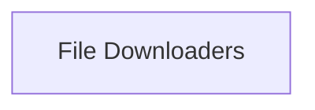

## Component Details

This overview details the 'File Downloaders' component, which is responsible for the low-level mechanics of fetching media data from URLs, supporting various protocols and external tools. It manages progress reporting, retries, and temporary files.

### File Downloaders
Handles the low-level mechanics of fetching media data from URLs, supporting various protocols and external tools. It manages progress reporting, retries, and temporary files.

**Related Classes/Methods**:

- `yt_dlp.yt_dlp.downloader.common.FileDownloader` (full file reference)
- `yt_dlp.yt_dlp.downloader.common.FileDownloader:download` (236:269)
- `yt_dlp.yt_dlp.downloader.http.HttpFD` (full file reference)
- `yt_dlp.yt_dlp.downloader.hls.HlsFD` (full file reference)
- `yt_dlp.yt_dlp.downloader.external.ExternalFD` (full file reference)

### [FAQ](https://github.com/CodeBoarding/GeneratedOnBoardings/tree/main?tab=readme-ov-file#faq)