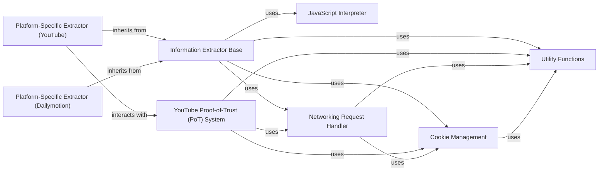

## Component Details

The Information Extraction subsystem is responsible for identifying and parsing video and audio metadata and stream URLs from various online sources. It leverages a base extractor class for common functionalities and extends it with platform-specific logic. This subsystem interacts heavily with networking components to fetch web pages, and includes a JavaScript interpreter to handle dynamic content. For certain platforms like YouTube, it incorporates specialized modules to manage authentication and access tokens, often relying on cookie management for session persistence. Utility functions provide common data manipulation, error handling, and format sorting capabilities across the subsystem.

### Information Extractor Base
An abstract base class that defines the common interface and core functionalities for all specific information extractors. It provides utilities for web requests, data parsing, and general extraction logic.

**Related Classes/Methods**:

- <a href="https://github.com/yt-dlp/yt-dlp/blob/master/yt_dlp/extractor/common.py#L106-L4002" target="_blank" rel="noopener noreferrer">`yt_dlp.extractor.common.InfoExtractor` (106:4002)</a>
- <a href="https://github.com/yt-dlp/yt-dlp/blob/master/yt_dlp/extractor/common.py#L813-L815" target="_blank" rel="noopener noreferrer">`yt_dlp.extractor.common.InfoExtractor:_real_extract` (813:815)</a>

### Platform-Specific Extractor (YouTube)
A concrete implementation of the Information Extractor Base, specifically designed to extract video information and available formats from YouTube URLs, handling YouTube's unique parsing requirements.

**Related Classes/Methods**:

- <a href="https://github.com/yt-dlp/yt-dlp/blob/master/yt_dlp/extractor/youtube/_video.py#L81-L4318" target="_blank" rel="noopener noreferrer">`yt_dlp.extractor.youtube._video.YoutubeIE` (81:4318)</a>

### Platform-Specific Extractor (Dailymotion)
A concrete implementation of the Information Extractor Base, responsible for extracting video details from Dailymotion URLs.

**Related Classes/Methods**:

- <a href="https://github.com/yt-dlp/yt-dlp/blob/master/yt_dlp/extractor/dailymotion.py#L101-L479" target="_blank" rel="noopener noreferrer">`yt_dlp.extractor.dailymotion.DailymotionIE` (101:479)</a>

### YouTube Proof-of-Trust (PoT) System
A specialized sub-component within the YouTube extractor responsible for handling the Proof-of-Trust (PoT) token system. It manages token requests, caching, and interaction with YouTube's backend to bypass access restrictions.

**Related Classes/Methods**:

- <a href="https://github.com/yt-dlp/yt-dlp/blob/master/yt_dlp/extractor/youtube/pot/_director.py#L253-L346" target="_blank" rel="noopener noreferrer">`yt_dlp.extractor.youtube.pot._director.PoTokenRequestDirector` (253:346)</a>
- <a href="https://github.com/yt-dlp/yt-dlp/blob/master/yt_dlp/extractor/youtube/pot/provider.py#L107-L229" target="_blank" rel="noopener noreferrer">`yt_dlp.extractor.youtube.pot.provider.PoTokenProvider` (107:229)</a>
- <a href="https://github.com/yt-dlp/yt-dlp/blob/master/yt_dlp/extractor/youtube/pot/cache.py#L28-L39" target="_blank" rel="noopener noreferrer">`yt_dlp.extractor.youtube.pot.cache.PoTokenCacheProvider` (28:39)</a>

### JavaScript Interpreter
This component is capable of interpreting and executing JavaScript code found on web pages, primarily used by information extractors to resolve dynamic content or obfuscated URLs.

**Related Classes/Methods**:

- <a href="https://github.com/yt-dlp/yt-dlp/blob/master/yt_dlp/jsinterp.py#L255-L932" target="_blank" rel="noopener noreferrer">`yt_dlp.jsinterp.JSInterpreter` (255:932)</a>

### Networking Request Handler
A base component for handling various types of network requests, abstracting the underlying HTTP client implementation. It is used by extractors to fetch web pages and manage network interactions.

**Related Classes/Methods**:

- <a href="https://github.com/yt-dlp/yt-dlp/blob/master/yt_dlp/networking/common.py#L149-L382" target="_blank" rel="noopener noreferrer">`yt_dlp.networking.common.RequestHandler` (149:382)</a>

### Utility Functions
A collection of general-purpose helper functions and utility classes used by various components, including extractors, for tasks like error handling, data formatting, and common data manipulations.

**Related Classes/Methods**:

- <a href="https://github.com/yt-dlp/yt-dlp/blob/master/yt_dlp/utils/_utils.py#L956-L965" target="_blank" rel="noopener noreferrer">`yt_dlp.utils._utils.YoutubeDLError` (956:965)</a>
- <a href="https://github.com/yt-dlp/yt-dlp/blob/master/yt_dlp/utils/_utils.py#L5319-L5618" target="_blank" rel="noopener noreferrer">`yt_dlp.utils._utils.FormatSorter` (5319:5618)</a>
- <a href="https://github.com/yt-dlp/yt-dlp/blob/master/yt_dlp/utils/networking.py#L62-L196" target="_blank" rel="noopener noreferrer">`yt_dlp.utils.networking.HTTPHeaderDict` (62:196)</a>

### Cookie Management
Handles the loading, saving, and decryption of browser cookies, enabling extractors to access content that requires user authentication or session management.

**Related Classes/Methods**:

- <a href="https://github.com/yt-dlp/yt-dlp/blob/master/yt_dlp/cookies.py#L1242-L1386" target="_blank" rel="noopener noreferrer">`yt_dlp.cookies.YoutubeDLCookieJar` (1242:1386)</a>
- <a href="https://github.com/yt-dlp/yt-dlp/blob/master/yt_dlp/cookies.py#L382-L413" target="_blank" rel="noopener noreferrer">`yt_dlp.cookies.ChromeCookieDecryptor` (382:413)</a>

### [FAQ](https://github.com/CodeBoarding/GeneratedOnBoardings/tree/main?tab=readme-ov-file#faq)