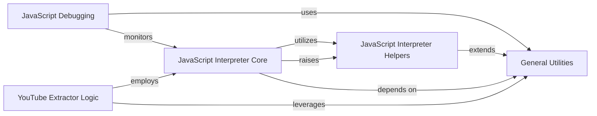

## Component Details

This system provides a lightweight, custom JavaScript interpreter primarily used by Information Extraction modules within yt-dlp. Its main purpose is to execute obfuscated JavaScript code, which is often encountered in web pages for tasks such as signature decryption or dynamic data extraction. The interpreter core handles the fundamental parsing and execution of JavaScript, supported by helper functions for specific operations and debugging capabilities. Various extractors, notably the YouTube Extractor, leverage this interpreter to process JavaScript-driven content and retrieve necessary video metadata and stream URLs.

### JavaScript Interpreter Core
This component is the heart of the JavaScript interpretation engine within yt-dlp. It is responsible for parsing, evaluating, and executing JavaScript code snippets, handling various language constructs like expressions, statements, function calls, and object manipulation. It provides the fundamental logic for dynamic JavaScript execution.

**Related Classes/Methods**:

- `yt_dlp.yt_dlp.jsinterp.JSInterpreter` (full file reference)
- `yt_dlp.yt_dlp.jsinterp.JSInterpreter.interpret_statement` (full file reference)
- `yt_dlp.yt_dlp.jsinterp.JSInterpreter.interpret_expression` (full file reference)
- `yt_dlp.yt_dlp.jsinterp.JSInterpreter.extract_object` (full file reference)
- `yt_dlp.yt_dlp.jsinterp.JSInterpreter.extract_function_code` (full file reference)
- `yt_dlp.yt_dlp.jsinterp.JSInterpreter.extract_function` (full file reference)
- `yt_dlp.yt_dlp.jsinterp.JSInterpreter.extract_function_from_code` (full file reference)
- `yt_dlp.yt_dlp.jsinterp.JSInterpreter.call_function` (full file reference)
- `yt_dlp.yt_dlp.jsinterp.JSInterpreter.build_function` (full file reference)
- `yt_dlp.yt_dlp.jsinterp.JSInterpreter._named_object` (full file reference)
- `yt_dlp.yt_dlp.jsinterp.JSInterpreter._separate_at_paren` (full file reference)
- `yt_dlp.yt_dlp.jsinterp.JSInterpreter._operator` (full file reference)
- `yt_dlp.yt_dlp.jsinterp.JSInterpreter._index` (full file reference)
- `yt_dlp.yt_dlp.jsinterp.JSInterpreter._dump` (full file reference)
- `yt_dlp.yt_dlp.jsinterp.JSInterpreter._regex_flags` (full file reference)
- `yt_dlp.yt_dlp.jsinterp.LocalNameSpace` (full file reference)
- `yt_dlp.yt_dlp.jsinterp.JSInterpreter.Exception` (full file reference)

### JavaScript Interpreter Helpers
This component provides auxiliary functions and custom exception classes that support the core JavaScript interpreter. These helpers handle specific JavaScript operations like bitwise operations and ternary expressions, and define custom exceptions for control flow within the interpreted JavaScript code.

**Related Classes/Methods**:

- `yt_dlp.yt_dlp.jsinterp._js_bit_op` (full file reference)
- `yt_dlp.yt_dlp.jsinterp._js_bit_op.zeroise` (full file reference)
- `yt_dlp.yt_dlp.jsinterp._js_ternary` (full file reference)
- `yt_dlp.yt_dlp.jsinterp.JS_Break` (full file reference)
- `yt_dlp.yt_dlp.jsinterp.JS_Continue` (full file reference)
- `yt_dlp.yt_dlp.jsinterp.JS_Throw` (full file reference)

### JavaScript Debugging
This component provides functionality for debugging the JavaScript interpretation process. It allows for writing debug information and wrapping the interpreter to monitor its execution, aiding in understanding and troubleshooting JavaScript parsing and execution.

**Related Classes/Methods**:

- `yt_dlp.yt_dlp.jsinterp.Debugger` (full file reference)
- `yt_dlp.yt_dlp.jsinterp.Debugger.write` (full file reference)
- `yt_dlp.yt_dlp.jsinterp.Debugger.wrap_interpreter` (full file reference)

### General Utilities
This component comprises a collection of general-purpose utility functions used throughout the yt-dlp project. These utilities provide common functionalities such as string manipulation, error handling, and data processing, which are leveraged by various other components, including the JavaScript interpreter and extractors.

**Related Classes/Methods**:

- `yt_dlp.yt_dlp.utils._utils.ExtractorError` (full file reference)
- `yt_dlp.yt_dlp.utils._utils.write_string` (full file reference)
- `yt_dlp.yt_dlp.utils._utils.truncate_string` (full file reference)
- `yt_dlp.yt_dlp.utils._utils.function_with_repr` (full file reference)
- `yt_dlp.yt_dlp.utils._utils.js_to_json` (full file reference)
- `yt_dlp.yt_dlp.utils._utils.remove_quotes` (full file reference)
- `yt_dlp.yt_dlp.utils._utils.unified_timestamp` (full file reference)
- `yt_dlp.yt_dlp.utils._utils.filter_dict` (full file reference)
- `yt_dlp.yt_dlp.utils._utils.join_nonempty` (full file reference)

### YouTube Extractor Logic
This component is specifically responsible for extracting video information from YouTube. It interacts with the JavaScript interpreter to decipher dynamic JavaScript code, often used for signature decryption or other player-related logic, to obtain necessary video metadata and stream URLs. It also handles caching and player data management.

**Related Classes/Methods**:

- `yt_dlp.yt_dlp.extractor.youtube._video.YoutubeIE` (full file reference)
- `yt_dlp.yt_dlp.extractor.youtube._video.YoutubeIE._parse_sig_js` (full file reference)
- `yt_dlp.yt_dlp.extractor.youtube._video.YoutubeIE._interpret_player_js_global_var` (full file reference)
- `yt_dlp.yt_dlp.extractor.youtube._video.YoutubeIE._extract_n_function_code` (full file reference)
- `yt_dlp.yt_dlp.extractor.youtube._video.YoutubeIE._cached` (full file reference)
- `yt_dlp.yt_dlp.extractor.youtube._video.YoutubeIE._cached.inner` (full file reference)
- `yt_dlp.yt_dlp.extractor.youtube._video.YoutubeIE._extract_player_info` (full file reference)
- `yt_dlp.yt_dlp.extractor.youtube._video.YoutubeIE._load_player_data_from_cache` (full file reference)
- `yt_dlp.yt_dlp.extractor.youtube._video.YoutubeIE._load_player` (full file reference)
- `yt_dlp.yt_dlp.extractor.youtube._video.YoutubeIE._extract_n_function_name` (full file reference)
- `yt_dlp.yt_dlp.extractor.youtube._video.YoutubeIE._fixup_n_function_code` (full file reference)
- `yt_dlp.yt_dlp.extractor.common.InfoExtractor._search_regex` (full file reference)
- `yt_dlp.yt_dlp.extractor.common.InfoExtractor.write_debug` (full file reference)

### [FAQ](https://github.com/CodeBoarding/GeneratedOnBoardings/tree/main?tab=readme-ov-file#faq)