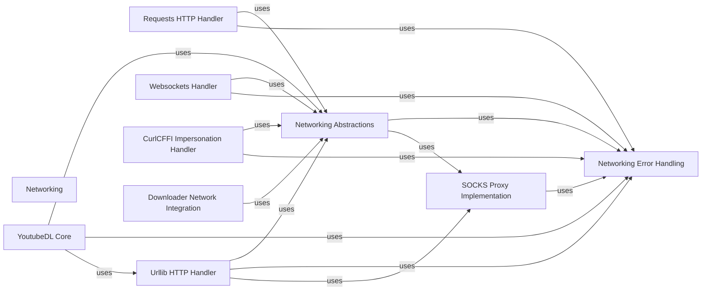

## Component Details

The Networking subsystem in yt-dlp is responsible for all network communication. It provides a flexible architecture through abstractions for various request handlers (e.g., urllib, requests, websockets, curlcffi) and manages common networking concerns such as proxy settings, SSL contexts, and error handling. The core YoutubeDL component utilizes these networking capabilities to fetch and process media, while various downloaders integrate with the networking abstractions to perform their specific download tasks.

### Networking
Manages all aspects of network communication, including creating and sending HTTP/HTTPS requests, handling responses, and managing proxies (including SOCKS) and SSL contexts.

**Related Classes/Methods**:

- `yt_dlp.yt_dlp.networking.common.RequestDirector` (full file reference)
- `yt_dlp.yt_dlp.networking.common.RequestDirector:send` (78:109)
- `yt_dlp.yt_dlp.networking.common.RequestHandler` (full file reference)
- `yt_dlp.yt_dlp.networking._urllib.UrllibRH` (full file reference)
- `yt_dlp.yt_dlp.networking._requests.RequestsRH` (full file reference)
- `yt_dlp.yt_dlp.socks.sockssocket` (full file reference)

### YoutubeDL Core
This component encapsulates the main logic of yt-dlp, including initialization, managing network requests, and handling headers and proxies. It orchestrates the overall download process by interacting with various networking components.

**Related Classes/Methods**:

- `yt_dlp.yt_dlp.YoutubeDL` (full file reference)
- `yt_dlp.yt_dlp.YoutubeDL:__init__` (full file reference)
- `yt_dlp.yt_dlp.YoutubeDL:close` (full file reference)
- `yt_dlp.yt_dlp.YoutubeDL:_calc_headers` (full file reference)
- `yt_dlp.yt_dlp.YoutubeDL:urlopen` (full file reference)
- `yt_dlp.yt_dlp.YoutubeDL:build_request_director` (full file reference)
- `yt_dlp.yt_dlp.YoutubeDL:_request_director` (full file reference)
- `yt_dlp.yt_dlp.compat.urllib_req_to_req` (full file reference)

### Networking Abstractions
This component provides the foundational classes and utilities for network operations, defining common interfaces for requests, responses, and request handling. It includes a director for managing different request handlers and general networking utilities like header manipulation, URL normalization, and SSL/SOCKS helper functions.

**Related Classes/Methods**:

- `yt_dlp.yt_dlp.networking.common.RequestDirector` (full file reference)
- `yt_dlp.yt_dlp.networking.common.RequestDirector.close` (full file reference)
- `yt_dlp.yt_dlp.networking.common.RequestDirector.add_handler` (full file reference)
- `yt_dlp.yt_dlp.networking.common.RequestDirector._get_handlers` (full file reference)
- `yt_dlp.yt_dlp.networking.common.RequestDirector:send` (full file reference)
- `yt_dlp.yt_dlp.networking.common.RequestHandler` (full file reference)
- `yt_dlp.yt_dlp.networking.common.RequestHandler:__init__` (full file reference)
- `yt_dlp.yt_dlp.networking.common.RequestHandler:_make_sslcontext` (full file reference)
- `yt_dlp.yt_dlp.networking.common.RequestHandler:_merge_headers` (full file reference)
- `yt_dlp.yt_dlp.networking.common.RequestHandler:_get_headers` (full file reference)
- `yt_dlp.yt_dlp.networking.common.RequestHandler:_check_url_scheme` (full file reference)
- `yt_dlp.yt_dlp.networking.common.RequestHandler:_check_proxies` (full file reference)
- `yt_dlp.yt_dlp.networking.common.RequestHandler:_validate` (full file reference)
- `yt_dlp.yt_dlp.networking.common.RequestHandler:validate` (full file reference)
- `yt_dlp.yt_dlp.networking.common.RequestHandler:send` (full file reference)
- `yt_dlp.yt_dlp.networking.common.RequestHandler:__exit__` (full file reference)
- `yt_dlp.yt_dlp.networking.common.RequestHandler.close` (full file reference)
- `yt_dlp.yt_dlp.networking.common.RequestHandler._check_extensions` (full file reference)
- `yt_dlp.yt_dlp.networking.common.RequestHandler._get_cookiejar` (full file reference)
- `yt_dlp.yt_dlp.networking.common.RequestHandler._get_proxies` (full file reference)
- `yt_dlp.yt_dlp.networking.common.RequestHandler._calculate_timeout` (full file reference)
- `yt_dlp.yt_dlp.networking.common.Request` (full file reference)
- `yt_dlp.yt_dlp.networking.common.Request:__init__` (full file reference)
- `yt_dlp.yt_dlp.networking.common.Request:url` (full file reference)
- `yt_dlp.yt_dlp.networking.common.Request:headers` (full file reference)
- `yt_dlp.yt_dlp.networking.common.Request:update` (full file reference)
- `yt_dlp.yt_dlp.networking.common.Request:copy` (full file reference)
- `yt_dlp.yt_dlp.networking.common.Response` (full file reference)
- `yt_dlp.yt_dlp.networking.common.Response:read` (full file reference)
- `yt_dlp.yt_dlp.networking.common.Response:code` (full file reference)
- `yt_dlp.yt_dlp.networking.common.Response:getcode` (full file reference)
- `yt_dlp.yt_dlp.networking.common.Response:geturl` (full file reference)
- `yt_dlp.yt_dlp.networking.common.Response:info` (full file reference)
- `yt_dlp.yt_dlp.networking.common.Response:getheader` (full file reference)
- `yt_dlp.yt_dlp.networking.common.Response.get_header` (full file reference)
- `yt_dlp.yt_dlp.networking.common.Response.close` (full file reference)
- `yt_dlp.yt_dlp.networking.common.register_preference` (full file reference)
- `yt_dlp.yt_dlp.utils.networking.HTTPHeaderDict` (full file reference)
- `yt_dlp.yt_dlp.utils.networking.HTTPHeaderDict:__init__` (full file reference)
- `yt_dlp.yt_dlp.utils.networking.HTTPHeaderDict:__ior__` (full file reference)
- `yt_dlp.yt_dlp.utils.networking.HTTPHeaderDict:__or__` (full file reference)
- `yt_dlp.yt_dlp.utils.networking.HTTPHeaderDict:__ror__` (full file reference)
- `yt_dlp.yt_dlp.utils.networking.HTTPHeaderDict:copy` (full file reference)
- `yt_dlp.yt_dlp.utils.networking.HTTPHeaderDict.get` (full file reference)
- `yt_dlp.yt_dlp.utils.networking.HTTPHeaderDict.pop` (full file reference)
- `yt_dlp.yt_dlp.utils.networking.HTTPHeaderDict.update` (full file reference)
- `yt_dlp.yt_dlp.utils.networking.clean_headers` (full file reference)
- `yt_dlp.yt_dlp.utils.networking.clean_proxies` (full file reference)
- `yt_dlp.yt_dlp.utils.networking.normalize_url` (full file reference)
- `yt_dlp.yt_dlp.utils.networking.select_proxy` (full file reference)
- `yt_dlp.yt_dlp.networking._helper.ssl_load_certs` (full file reference)
- `yt_dlp.yt_dlp.networking._helper.ssl_load_windows_store_certs` (full file reference)
- `yt_dlp.yt_dlp.networking._helper.make_socks_proxy_opts` (full file reference)
- `yt_dlp.yt_dlp.networking._helper.make_ssl_context` (full file reference)
- `yt_dlp.yt_dlp.networking._helper.InstanceStoreMixin._get_instance` (full file reference)
- `yt_dlp.yt_dlp.networking._helper.InstanceStoreMixin._clear_instances` (full file reference)
- `yt_dlp.yt_dlp.networking._helper.InstanceStoreMixin._create_instance` (full file reference)
- `yt_dlp.yt_dlp.networking._helper.InstanceStoreMixin._close_instance` (full file reference)
- `yt_dlp.yt_dlp.networking._helper.create_socks_proxy_socket` (full file reference)
- `yt_dlp.yt_dlp.networking._helper.create_connection` (full file reference)
- `yt_dlp.yt_dlp.networking._helper.add_accept_encoding_header` (full file reference)
- `yt_dlp.yt_dlp.networking._helper.get_redirect_method` (full file reference)

### Networking Error Handling
This component defines a comprehensive set of exceptions for various network-related errors, such as request failures, HTTP errors, incomplete reads, and SSL/proxy issues. It centralizes error reporting for network operations.

**Related Classes/Methods**:

- `yt_dlp.yt_dlp.networking.exceptions.RequestError` (full file reference)
- `yt_dlp.yt_dlp.networking.exceptions.RequestError:__init__` (full file reference)
- `yt_dlp.yt_dlp.networking.exceptions.NoSupportingHandlers` (full file reference)
- `yt_dlp.yt_dlp.networking.exceptions.NoSupportingHandlers:__init__` (full file reference)
- `yt_dlp.yt_dlp.networking.exceptions.HTTPError` (full file reference)
- `yt_dlp.yt_dlp.networking.exceptions.HTTPError:__init__` (full file reference)
- `yt_dlp.yt_dlp.networking.exceptions.IncompleteRead` (full file reference)
- `yt_dlp.yt_dlp.networking.exceptions.IncompleteRead:__init__` (full file reference)
- `yt_dlp.yt_dlp.networking.exceptions.CertificateVerifyError` (full file reference)
- `yt_dlp.yt_dlp.networking.exceptions.SSLError` (full file reference)
- `yt_dlp.yt_dlp.networking.exceptions.ProxyError` (full file reference)
- `yt_dlp.yt_dlp.networking.exceptions.TransportError` (full file reference)
- `yt_dlp.yt_dlp.networking.exceptions.UnsupportedRequest` (full file reference)

### SOCKS Proxy Implementation
This component provides the low-level implementation for SOCKS proxy connections, including socket handling, proxy setup, and error management specific to SOCKS protocols.

**Related Classes/Methods**:

- `yt_dlp.yt_dlp.socks.sockssocket` (full file reference)
- `yt_dlp.yt_dlp.socks.sockssocket:setproxy` (full file reference)
- `yt_dlp.yt_dlp.socks.sockssocket:_check_response_version` (full file reference)
- `yt_dlp.yt_dlp.socks.sockssocket:_setup_socks4` (full file reference)
- `yt_dlp.yt_dlp.socks.sockssocket:_setup_socks4a` (full file reference)
- `yt_dlp.yt_dlp.socks.sockssocket:_socks5_auth` (full file reference)
- `yt_dlp.yt_dlp.socks.sockssocket:_setup_socks5` (full file reference)
- `yt_dlp.yt_dlp.socks.sockssocket:connect` (full file reference)
- `yt_dlp.yt_dlp.socks.sockssocket:connect_ex` (full file reference)
- `yt_dlp.yt_dlp.socks.sockssocket._make_proxy` (full file reference)
- `yt_dlp.yt_dlp.socks.Proxy` (full file reference)
- `yt_dlp.yt_dlp.socks.InvalidVersionError` (full file reference)
- `yt_dlp.yt_dlp.socks.Socks4Error` (full file reference)
- `yt_dlp.yt_dlp.socks.Socks5Error` (full file reference)

### Requests HTTP Handler
This component integrates the `requests` library for handling HTTP requests. It adapts `requests` sessions and responses to the common networking interfaces, managing connections, TLS contexts, and redirect methods.

**Related Classes/Methods**:

- `yt_dlp.yt_dlp.networking._requests.RequestsResponseAdapter` (full file reference)
- `yt_dlp.yt_dlp.networking._requests.RequestsResponseAdapter:__init__` (full file reference)
- `yt_dlp.yt_dlp.networking._requests.RequestsResponseAdapter:read` (full file reference)
- `yt_dlp.yt_dlp.networking._requests.RequestsHTTPAdapter` (full file reference)
- `yt_dlp.yt_dlp.networking._requests.RequestsHTTPAdapter:get_connection_with_tls_context` (full file reference)
- `yt_dlp.yt_dlp.networking._requests.RequestsSession` (full file reference)
- `yt_dlp.yt_dlp.networking._requests.RequestsSession:rebuild_method` (full file reference)
- `yt_dlp.yt_dlp.networking._requests.RequestsRH` (full file reference)
- `yt_dlp.yt_dlp.networking._requests.RequestsRH:__init__` (full file reference)
- `yt_dlp.yt_dlp.networking._requests.RequestsRH:close` (full file reference)
- `yt_dlp.yt_dlp.networking._requests.RequestsRH:_check_extensions` (full file reference)
- `yt_dlp.yt_dlp.networking._requests.RequestsRH:_create_instance` (full file reference)
- `yt_dlp.yt_dlp.networking._requests.RequestsRH:_prepare_headers` (full file reference)
- `yt_dlp.yt_dlp.networking._requests.RequestsRH:_send` (full file reference)
- `yt_dlp.yt_dlp.networking._requests.SocksHTTPConnection:_new_conn` (full file reference)
- `yt_dlp.yt_dlp.networking._requests.SocksProxyManager:__init__` (full file reference)
- `yt_dlp.yt_dlp.networking._requests:requests_preference` (full file reference)

### Urllib HTTP Handler
This component utilizes Python's built-in `urllib` library for HTTP request handling. It provides handlers for HTTP and HTTPS, manages proxy settings, and adapts `urllib` responses to the common networking interfaces.

**Related Classes/Methods**:

- `yt_dlp.yt_dlp.networking._urllib.HTTPHandler` (full file reference)
- `yt_dlp.yt_dlp.networking._urllib.HTTPHandler:_make_conn_class` (full file reference)
- `yt_dlp.yt_dlp.networking._urllib.HTTPHandler:http_open` (full file reference)
- `yt_dlp.yt_dlp.networking._urllib.HTTPHandler:https_open` (full file reference)
- `yt_dlp.yt_dlp.networking._urllib.HTTPHandler:http_request` (full file reference)
- `yt_dlp.yt_dlp.networking._urllib.HTTPHandler:http_response` (full file reference)
- `yt_dlp.yt_dlp.networking._urllib.make_socks_conn_class` (full file reference)
- `yt_dlp.yt_dlp.networking._urllib.RedirectHandler` (full file reference)
- `yt_dlp.yt_dlp.networking._urllib.RedirectHandler:redirect_request` (full file reference)
- `yt_dlp.yt_dlp.networking._urllib.ProxyHandler` (full file reference)
- `yt_dlp.yt_dlp.networking._urllib.ProxyHandler:__init__` (full file reference)
- `yt_dlp.yt_dlp.networking._urllib.ProxyHandler:proxy_open` (full file reference)
- `yt_dlp.yt_dlp.networking._urllib.update_Request` (full file reference)
- `yt_dlp.yt_dlp.networking._urllib.HEADRequest` (full file reference)
- `yt_dlp.yt_dlp.networking._urllib.UrllibResponseAdapter` (full file reference)
- `yt_dlp.yt_dlp.networking._urllib.UrllibResponseAdapter:__init__` (full file reference)
- `yt_dlp.yt_dlp.networking._urllib.UrllibResponseAdapter:read` (full file reference)
- `yt_dlp.yt_dlp.networking._urllib.handle_sslerror` (full file reference)
- `yt_dlp.yt_dlp.networking._urllib.handle_response_read_exceptions` (full file reference)
- `yt_dlp.yt_dlp.networking._urllib.UrllibRH` (full file reference)
- `yt_dlp.yt_dlp.networking._urllib.UrllibRH:__init__` (full file reference)
- `yt_dlp.yt_dlp.networking._urllib.UrllibRH:_check_extensions` (full file reference)
- `yt_dlp.yt_dlp.networking._urllib.UrllibRH:_create_instance` (full file reference)
- `yt_dlp.yt_dlp.networking._urllib.UrllibRH:_prepare_headers` (full file reference)
- `yt_dlp.yt_dlp.networking._urllib.UrllibRH:_send` (full file reference)
- `yt_dlp.yt_dlp.utils._legacy.sanitized_Request` (full file reference)
- `yt_dlp.yt_dlp.utils._legacy.YoutubeDLHandler` (full file reference)
- `yt_dlp.yt_dlp.utils._legacy.YoutubeDLHandler:__init__` (full file reference)
- `yt_dlp.yt_dlp.utils._legacy:make_HTTPS_handler` (full file reference)

### Websockets Handler
This component provides functionality for handling websocket connections, adapting websocket responses to the common networking interfaces and managing send/receive operations.

**Related Classes/Methods**:

- `yt_dlp.yt_dlp.networking._websockets.WebsocketsResponseAdapter` (full file reference)
- `yt_dlp.yt_dlp.networking._websockets.WebsocketsResponseAdapter:__init__` (full file reference)
- `yt_dlp.yt_dlp.networking._websockets.WebsocketsResponseAdapter:close` (full file reference)
- `yt_dlp.yt_dlp.networking._websockets.WebsocketsResponseAdapter:send` (full file reference)
- `yt_dlp.yt_dlp.networking._websockets.WebsocketsResponseAdapter:recv` (full file reference)
- `yt_dlp.yt_dlp.networking._websockets.WebsocketsRH` (full file reference)
- `yt_dlp.yt_dlp.networking._websockets.WebsocketsRH:__init__` (full file reference)
- `yt_dlp.yt_dlp.networking._websockets.WebsocketsRH:_check_extensions` (full file reference)
- `yt_dlp.yt_dlp.networking._websockets.WebsocketsRH:_prepare_headers` (full file reference)
- `yt_dlp.yt_dlp.networking._websockets.WebsocketsRH:_send` (full file reference)

### CurlCFFI Impersonation Handler
This component leverages the `curlcffi` library for advanced HTTP request handling, specifically focusing on impersonating browser requests. It manages impersonation targets and integrates with the common networking interfaces.

**Related Classes/Methods**:

- `yt_dlp.yt_dlp.networking._curlcffi.CurlCFFIResponseReader` (full file reference)
- `yt_dlp.yt_dlp.networking._curlcffi.CurlCFFIResponseReader:read` (full file reference)
- `yt_dlp.yt_dlp.networking._curlcffi.CurlCFFIResponseAdapter` (full file reference)
- `yt_dlp.yt_dlp.networking._curlcffi.CurlCFFIResponseAdapter:__init__` (full file reference)
- `yt_dlp.yt_dlp.networking._curlcffi.CurlCFFIResponseAdapter:read` (full file reference)
- `yt_dlp.yt_dlp.networking._curlcffi.CurlCFFIRH` (full file reference)
- `yt_dlp.yt_dlp.networking._curlcffi.CurlCFFIRH:_check_extensions` (full file reference)
- `yt_dlp.yt_dlp.networking._curlcffi.CurlCFFIRH:send` (full file reference)
- `yt_dlp.yt_dlp.networking._curlcffi.CurlCFFIRH:_send` (full file reference)
- `yt_dlp.yt_dlp.networking._curlcffi:curl_cffi_preference` (full file reference)
- `yt_dlp.yt_dlp.networking.impersonate.ImpersonateTarget` (full file reference)
- `yt_dlp.yt_dlp.networking.impersonate.ImpersonateTarget:__str__` (full file reference)
- `yt_dlp.yt_dlp.networking.impersonate.ImpersonateTarget:from_str` (full file reference)
- `yt_dlp.yt_dlp.networking.impersonate.ImpersonateRequestHandler` (full file reference)
- `yt_dlp.yt_dlp.networking.impersonate.ImpersonateRequestHandler:__init__` (full file reference)
- `yt_dlp.yt_dlp.networking.impersonate.ImpersonateRequestHandler:_check_impersonate_target` (full file reference)
- `yt_dlp.yt_dlp.networking.impersonate.ImpersonateRequestHandler:_check_extensions` (full file reference)
- `yt_dlp.yt_dlp.networking.impersonate.ImpersonateRequestHandler:_validate` (full file reference)
- `yt_dlp.yt_dlp.networking.impersonate.ImpersonateRequestHandler:is_supported_target` (full file reference)
- `yt_dlp.yt_dlp.networking.impersonate.ImpersonateRequestHandler:_get_request_target` (full file reference)
- `yt_dlp.yt_dlp.networking.impersonate.ImpersonateRequestHandler:_get_impersonate_headers` (full file reference)
- `yt_dlp.yt_dlp.networking.impersonate.ImpersonateRequestHandler._resolve_target` (full file reference)
- `yt_dlp.yt_dlp.networking.impersonate:impersonate_preference` (full file reference)

### Downloader Network Integration
This component represents the various downloaders within `yt-dlp` that interact with the networking subsystem to fetch content. It demonstrates how different download protocols utilize the common networking request mechanisms.

**Related Classes/Methods**:

- `yt_dlp.yt_dlp.update.Updater:_call_api` (full file reference)
- `yt_dlp.yt_dlp.postprocessor.common.PostProcessor:_download_json` (full file reference)
- `yt_dlp.yt_dlp.downloader.bunnycdn.BunnyCdnFD:ping_thread` (full file reference)
- `yt_dlp.yt_dlp.downloader.http.HttpFD:real_download` (full file reference)
- `yt_dlp.yt_dlp.downloader.niconico.NiconicoLiveFD:real_download` (full file reference)
- `yt_dlp.yt_dlp.downloader.youtube_live_chat.YoutubeLiveChatFD:real_download` (full file reference)
- `yt_dlp.yt_dlp.downloader.fragment.FragmentFD:_prepare_url` (full file reference)
- `yt_dlp.yt_dlp.downloader.fragment.FragmentFD:download_and_append_fragments` (full file reference)

### [FAQ](https://github.com/CodeBoarding/GeneratedOnBoardings/tree/main?tab=readme-ov-file#faq)