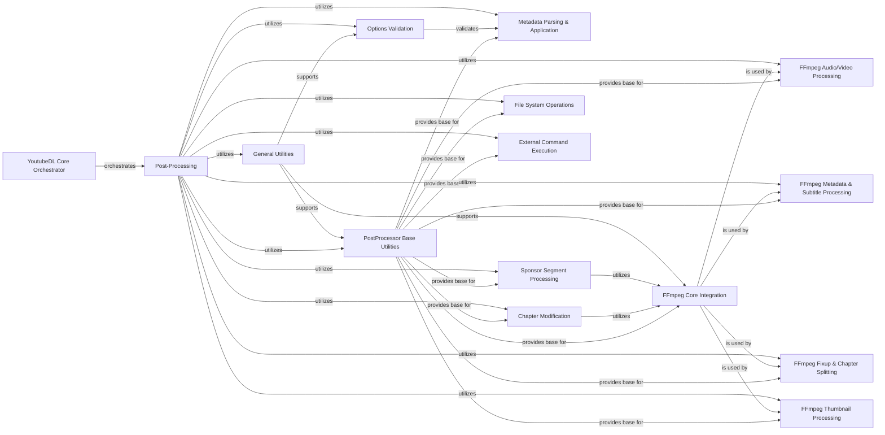

## Component Details

This graph illustrates the architecture of the Post-Processing subsystem within yt-dlp. The core functionality revolves around the `Post-Processing` component, which orchestrates various media manipulation tasks. It leverages `PostProcessor Base Utilities` for foundational operations and integrates heavily with `FFmpeg Core Integration` for tasks requiring FFmpeg. Specialized FFmpeg-related components handle audio/video processing, metadata/subtitle embedding, media fixups, chapter splitting, and thumbnail conversions. Beyond FFmpeg, the system includes components for `Metadata Parsing & Application`, `Chapter Modification`, `Sponsor Segment Processing`, `File System Operations`, and `External Command Execution`. The `YoutubeDL Core Orchestrator` initiates and manages the post-processing flow, while `Options Validation` ensures correct configurations. `General Utilities` provide common helper functions across the entire subsystem.

### Post-Processing
A suite of tools for manipulating downloaded media, including format conversion, metadata embedding, and chapter management, often leveraging external binaries like FFmpeg.

**Related Classes/Methods**:

- `yt_dlp.yt_dlp.postprocessor.common.PostProcessor` (full file reference)
- `yt_dlp.yt_dlp.postprocessor.common.PostProcessor:run` (109:112)

### YoutubeDL Core Orchestrator
Manages the overall download process, including adding and running post-processors, and handling information processing.

**Related Classes/Methods**:

- <a href="https://github.com/yt-dlp/yt-dlp/blob/master/yt_dlp/YoutubeDL.py#L902-L906" target="_blank" rel="noopener noreferrer">`yt-dlp.yt_dlp.YoutubeDL:add_post_processor` (902:906)</a>
- <a href="https://github.com/yt-dlp/yt-dlp/blob/master/yt_dlp/YoutubeDL.py#L2234-L2256" target="_blank" rel="noopener noreferrer">`yt-dlp.yt_dlp.YoutubeDL:_default_format_spec` (2234:2256)</a>
- <a href="https://github.com/yt-dlp/yt-dlp/blob/master/yt_dlp/YoutubeDL.py#L3250-L3610" target="_blank" rel="noopener noreferrer">`yt-dlp.yt_dlp.YoutubeDL:process_info` (3250:3610)</a>
- <a href="https://github.com/yt-dlp/yt-dlp/blob/master/yt_dlp/YoutubeDL.py#L3734-L3755" target="_blank" rel="noopener noreferrer">`yt-dlp.yt_dlp.YoutubeDL:run_pp` (3734:3755)</a>
- <a href="https://github.com/yt-dlp/yt-dlp/blob/master/yt_dlp/YoutubeDL.py#L3757-L3762" target="_blank" rel="noopener noreferrer">`yt-dlp.yt_dlp.YoutubeDL:run_all_pps` (3757:3762)</a>
- <a href="https://github.com/yt-dlp/yt-dlp/blob/master/yt_dlp/YoutubeDL.py#L3764-L3773" target="_blank" rel="noopener noreferrer">`yt-dlp.yt_dlp.YoutubeDL:pre_process` (3764:3773)</a>
- <a href="https://github.com/yt-dlp/yt-dlp/blob/master/yt_dlp/YoutubeDL.py#L3775-L3782" target="_blank" rel="noopener noreferrer">`yt-dlp.yt_dlp.YoutubeDL:post_process` (3775:3782)</a>
- <a href="https://github.com/yt-dlp/yt-dlp/blob/master/yt_dlp/YoutubeDL.py#L4017-L4119" target="_blank" rel="noopener noreferrer">`yt-dlp.yt_dlp.YoutubeDL:print_debug_header` (4017:4119)</a>

### PostProcessor Base Utilities
Provides the foundational classes and common utility methods for all post-processors, including progress reporting, error handling, and configuration management.

**Related Classes/Methods**:

- <a href="https://github.com/yt-dlp/yt-dlp/blob/master/yt_dlp/postprocessor/common.py#L30-L33" target="_blank" rel="noopener noreferrer">`yt-dlp.yt_dlp.postprocessor.common.PostProcessorMetaClass:__new__` (30:33)</a>
- <a href="https://github.com/yt-dlp/yt-dlp/blob/master/yt_dlp/postprocessor/common.py#L55-L59" target="_blank" rel="noopener noreferrer">`yt-dlp.yt_dlp.postprocessor.common.PostProcessor:__init__` (55:59)</a>
- <a href="https://github.com/yt-dlp/yt-dlp/blob/master/yt_dlp/postprocessor/common.py#L79-L82" target="_blank" rel="noopener noreferrer">`yt-dlp.yt_dlp.postprocessor.common.PostProcessor:deprecated_feature` (79:82)</a>
- <a href="https://github.com/yt-dlp/yt-dlp/blob/master/yt_dlp/postprocessor/common.py#L84-L88" target="_blank" rel="noopener noreferrer">`yt-dlp.yt_dlp.postprocessor.common.PostProcessor:report_error` (84:88)</a>
- <a href="https://github.com/yt-dlp/yt-dlp/blob/master/yt_dlp/postprocessor/common.py#L105-L109" target="_blank" rel="noopener noreferrer">`yt-dlp.yt_dlp.postprocessor.common.PostProcessor:set_downloader` (105:109)</a>
- <a href="https://github.com/yt-dlp/yt-dlp/blob/master/yt_dlp/postprocessor/common.py#L152-L156" target="_blank" rel="noopener noreferrer">`yt-dlp.yt_dlp.postprocessor.common.PostProcessor:try_utime` (152:156)</a>
- <a href="https://github.com/yt-dlp/yt-dlp/blob/master/yt_dlp/postprocessor/common.py#L158-L160" target="_blank" rel="noopener noreferrer">`yt-dlp.yt_dlp.postprocessor.common.PostProcessor:_configuration_args` (158:160)</a>
- <a href="https://github.com/yt-dlp/yt-dlp/blob/master/yt_dlp/postprocessor/common.py#L162-L170" target="_blank" rel="noopener noreferrer">`yt-dlp.yt_dlp.postprocessor.common.PostProcessor:_hook_progress` (162:170)</a>
- <a href="https://github.com/yt-dlp/yt-dlp/blob/master/yt_dlp/postprocessor/common.py#L176-L193" target="_blank" rel="noopener noreferrer">`yt-dlp.yt_dlp.postprocessor.common.PostProcessor:report_progress` (176:193)</a>
- <a href="https://github.com/yt-dlp/yt-dlp/blob/master/yt_dlp/postprocessor/common.py#L195-L199" target="_blank" rel="noopener noreferrer">`yt-dlp.yt_dlp.postprocessor.common.PostProcessor:_retry_download` (195:199)</a>
- <a href="https://github.com/yt-dlp/yt-dlp/blob/master/yt_dlp/postprocessor/common.py#L201-L211" target="_blank" rel="noopener noreferrer">`yt-dlp.yt_dlp.postprocessor.common.PostProcessor:_download_json` (201:211)</a>

### FFmpeg Core Integration
Encapsulates the core functionalities for interacting with FFmpeg, providing methods for version checking, running FFmpeg commands, and handling media stream operations. This is the base for all FFmpeg related PPs.

**Related Classes/Methods**:

- `yt_dlp.yt_dlp.postprocessor.ffmpeg.FFmpegPostProcessor` (full file reference)
- <a href="https://github.com/yt-dlp/yt-dlp/blob/master/yt_dlp/postprocessor/ffmpeg.py#L89-L92" target="_blank" rel="noopener noreferrer">`yt-dlp.yt_dlp.postprocessor.ffmpeg.FFmpegPostProcessor:__init__` (89:92)</a>
- <a href="https://github.com/yt-dlp/yt-dlp/blob/master/yt_dlp/postprocessor/ffmpeg.py#L95-L97" target="_blank" rel="noopener noreferrer">`yt-dlp.yt_dlp.postprocessor.ffmpeg.FFmpegPostProcessor:get_versions_and_features` (95:97)</a>
- <a href="https://github.com/yt-dlp/yt-dlp/blob/master/yt_dlp/postprocessor/ffmpeg.py#L100-L101" target="_blank" rel="noopener noreferrer">`yt-dlp.yt_dlp.postprocessor.ffmpeg.FFmpegPostProcessor:get_versions` (100:101)</a>
- <a href="https://github.com/yt-dlp/yt-dlp/blob/master/yt_dlp/postprocessor/ffmpeg.py#L105-L133" target="_blank" rel="noopener noreferrer">`yt-dlp.yt_dlp.postprocessor.ffmpeg.FFmpegPostProcessor:_determine_executables` (105:133)</a>
- <a href="https://github.com/yt-dlp/yt-dlp/blob/master/yt_dlp/postprocessor/ffmpeg.py#L137-L164" target="_blank" rel="noopener noreferrer">`yt-dlp.yt_dlp.postprocessor.ffmpeg.FFmpegPostProcessor:_get_ffmpeg_version` (137:164)</a>
- <a href="https://github.com/yt-dlp/yt-dlp/blob/master/yt_dlp/postprocessor/ffmpeg.py#L167-L168" target="_blank" rel="noopener noreferrer">`yt-dlp.yt_dlp.postprocessor.ffmpeg.FFmpegPostProcessor:_versions` (167:168)</a>
- <a href="https://github.com/yt-dlp/yt-dlp/blob/master/yt_dlp/postprocessor/ffmpeg.py#L180-L193" target="_blank" rel="noopener noreferrer">`yt-dlp.yt_dlp.postprocessor.ffmpeg.FFmpegPostProcessor:_get_version` (180:193)</a>
- <a href="https://github.com/yt-dlp/yt-dlp/blob/master/yt_dlp/postprocessor/ffmpeg.py#L200-L201" target="_blank" rel="noopener noreferrer">`yt-dlp.yt_dlp.postprocessor.ffmpeg.FFmpegPostProcessor:_probe_version` (200:201)</a>
- <a href="https://github.com/yt-dlp/yt-dlp/blob/master/yt_dlp/postprocessor/ffmpeg.py#L230-L237" target="_blank" rel="noopener noreferrer">`yt-dlp.yt_dlp.postprocessor.ffmpeg.FFmpegPostProcessor:check_version` (230:237)</a>
- <a href="https://github.com/yt-dlp/yt-dlp/blob/master/yt_dlp/postprocessor/ffmpeg.py#L239-L274" target="_blank" rel="noopener noreferrer">`yt-dlp.yt_dlp.postprocessor.ffmpeg.FFmpegPostProcessor:get_audio_codec` (239:274)</a>
- <a href="https://github.com/yt-dlp/yt-dlp/blob/master/yt_dlp/postprocessor/ffmpeg.py#L276-L296" target="_blank" rel="noopener noreferrer">`yt-dlp.yt_dlp.postprocessor.ffmpeg.FFmpegPostProcessor:get_metadata_object` (276:296)</a>
- <a href="https://github.com/yt-dlp/yt-dlp/blob/master/yt_dlp/postprocessor/ffmpeg.py#L298-L303" target="_blank" rel="noopener noreferrer">`yt-dlp.yt_dlp.postprocessor.ffmpeg.FFmpegPostProcessor:get_stream_number` (298:303)</a>
- <a href="https://github.com/yt-dlp/yt-dlp/blob/master/yt_dlp/postprocessor/ffmpeg.py#L305-L308" target="_blank" rel="noopener noreferrer">`yt-dlp.yt_dlp.postprocessor.ffmpeg.FFmpegPostProcessor:_fixup_chapters` (305:308)</a>
- <a href="https://github.com/yt-dlp/yt-dlp/blob/master/yt_dlp/postprocessor/ffmpeg.py#L310-L319" target="_blank" rel="noopener noreferrer">`yt-dlp.yt_dlp.postprocessor.ffmpeg.FFmpegPostProcessor:_get_real_video_duration` (310:319)</a>
- <a href="https://github.com/yt-dlp/yt-dlp/blob/master/yt_dlp/postprocessor/ffmpeg.py#L328-L331" target="_blank" rel="noopener noreferrer">`yt-dlp.yt_dlp.postprocessor.ffmpeg.FFmpegPostProcessor:run_ffmpeg_multiple_files` (328:331)</a>
- <a href="https://github.com/yt-dlp/yt-dlp/blob/master/yt_dlp/postprocessor/ffmpeg.py#L333-L371" target="_blank" rel="noopener noreferrer">`yt-dlp.yt_dlp.postprocessor.ffmpeg.FFmpegPostProcessor:real_run_ffmpeg` (333:371)</a>
- <a href="https://github.com/yt-dlp/yt-dlp/blob/master/yt_dlp/postprocessor/ffmpeg.py#L373-L374" target="_blank" rel="noopener noreferrer">`yt-dlp.yt_dlp.postprocessor.ffmpeg.FFmpegPostProcessor:run_ffmpeg` (373:374)</a>
- <a href="https://github.com/yt-dlp/yt-dlp/blob/master/yt_dlp/postprocessor/ffmpeg.py#L396-L405" target="_blank" rel="noopener noreferrer">`yt-dlp.yt_dlp.postprocessor.ffmpeg.FFmpegPostProcessor:force_keyframes` (396:405)</a>
- <a href="https://github.com/yt-dlp/yt-dlp/blob/master/yt_dlp/postprocessor/ffmpeg.py#L407-L424" target="_blank" rel="noopener noreferrer">`yt-dlp.yt_dlp.postprocessor.ffmpeg.FFmpegPostProcessor:concat_files` (407:424)</a>
- <a href="https://github.com/yt-dlp/yt-dlp/blob/master/yt_dlp/postprocessor/ffmpeg.py#L427-L436" target="_blank" rel="noopener noreferrer">`yt-dlp.yt_dlp.postprocessor.ffmpeg.FFmpegPostProcessor:_concat_spec` (427:436)</a>

### FFmpeg Audio/Video Processing
Handles audio extraction, video conversion, remuxing, and merging using FFmpeg.

**Related Classes/Methods**:

- <a href="https://github.com/yt-dlp/yt-dlp/blob/master/yt_dlp/postprocessor/ffmpeg.py#L444-L448" target="_blank" rel="noopener noreferrer">`yt-dlp.yt_dlp.postprocessor.ffmpeg.FFmpegExtractAudioPP:__init__` (444:448)</a>
- <a href="https://github.com/yt-dlp/yt-dlp/blob/master/yt_dlp/postprocessor/ffmpeg.py#L472-L481" target="_blank" rel="noopener noreferrer">`yt-dlp.yt_dlp.postprocessor.ffmpeg.FFmpegExtractAudioPP:run_ffmpeg` (472:481)</a>
- <a href="https://github.com/yt-dlp/yt-dlp/blob/master/yt_dlp/postprocessor/ffmpeg.py#L484-L542" target="_blank" rel="noopener noreferrer">`yt-dlp.yt_dlp.postprocessor.ffmpeg.FFmpegExtractAudioPP:run` (484:542)</a>
- <a href="https://github.com/yt-dlp/yt-dlp/blob/master/yt_dlp/postprocessor/ffmpeg.py#L553-L555" target="_blank" rel="noopener noreferrer">`yt-dlp.yt_dlp.postprocessor.ffmpeg.FFmpegVideoConvertorPP:__init__` (553:555)</a>
- <a href="https://github.com/yt-dlp/yt-dlp/blob/master/yt_dlp/postprocessor/ffmpeg.py#L558-L561" target="_blank" rel="noopener noreferrer">`yt-dlp.yt_dlp.postprocessor.ffmpeg.FFmpegVideoConvertorPP:_options` (558:561)</a>
- <a href="https://github.com/yt-dlp/yt-dlp/blob/master/yt_dlp/postprocessor/ffmpeg.py#L564-L577" target="_blank" rel="noopener noreferrer">`yt-dlp.yt_dlp.postprocessor.ffmpeg.FFmpegVideoConvertorPP:run` (564:577)</a>
- <a href="https://github.com/yt-dlp/yt-dlp/blob/master/yt_dlp/postprocessor/ffmpeg.py#L584-L585" target="_blank" rel="noopener noreferrer">`yt-dlp.yt_dlp.postprocessor.ffmpeg.FFmpegVideoRemuxerPP:_options` (584:585)</a>
- <a href="https://github.com/yt-dlp/yt-dlp/blob/master/yt_dlp/postprocessor/ffmpeg.py#L824-L841" target="_blank" rel="noopener noreferrer">`yt-dlp.yt_dlp.postprocessor.ffmpeg.FFmpegMergerPP:run` (824:841)</a>
- <a href="https://github.com/yt-dlp/yt-dlp/blob/master/yt_dlp/postprocessor/ffmpeg.py#L843-L856" target="_blank" rel="noopener noreferrer">`yt-dlp.yt_dlp.postprocessor.ffmpeg.FFmpegMergerPP:can_merge` (843:856)</a>
- <a href="https://github.com/yt-dlp/yt-dlp/blob/master/yt_dlp/postprocessor/ffmpeg.py#L1141-L1143" target="_blank" rel="noopener noreferrer">`yt-dlp.yt_dlp.postprocessor.ffmpeg.FFmpegConcatPP:__init__` (1141:1143)</a>
- <a href="https://github.com/yt-dlp/yt-dlp/blob/master/yt_dlp/postprocessor/ffmpeg.py#L1145-L1148" target="_blank" rel="noopener noreferrer">`yt-dlp.yt_dlp.postprocessor.ffmpeg.FFmpegConcatPP:_get_codecs` (1145:1148)</a>
- <a href="https://github.com/yt-dlp/yt-dlp/blob/master/yt_dlp/postprocessor/ffmpeg.py#L1150-L1166" target="_blank" rel="noopener noreferrer">`yt-dlp.yt_dlp.postprocessor.ffmpeg.FFmpegConcatPP:concat_files` (1150:1166)</a>
- <a href="https://github.com/yt-dlp/yt-dlp/blob/master/yt_dlp/postprocessor/ffmpeg.py#L1169-L1191" target="_blank" rel="noopener noreferrer">`yt-dlp.yt_dlp.postprocessor.ffmpeg.FFmpegConcatPP:run` (1169:1191)</a>

### FFmpeg Metadata & Subtitle Processing
Manages embedding subtitles and metadata, and converting subtitles using FFmpeg.

**Related Classes/Methods**:

- <a href="https://github.com/yt-dlp/yt-dlp/blob/master/yt_dlp/postprocessor/ffmpeg.py#L591-L593" target="_blank" rel="noopener noreferrer">`yt-dlp.yt_dlp.postprocessor.ffmpeg.FFmpegEmbedSubtitlePP:__init__` (591:593)</a>
- <a href="https://github.com/yt-dlp/yt-dlp/blob/master/yt_dlp/postprocessor/ffmpeg.py#L596-L666" target="_blank" rel="noopener noreferrer">`yt-dlp.yt_dlp.postprocessor.ffmpeg.FFmpegEmbedSubtitlePP:run` (596:666)</a>
- <a href="https://github.com/yt-dlp/yt-dlp/blob/master/yt_dlp/postprocessor/ffmpeg.py#L671-L675" target="_blank" rel="noopener noreferrer">`yt-dlp.yt_dlp.postprocessor.ffmpeg.FFmpegMetadataPP:__init__` (671:675)</a>
- <a href="https://github.com/yt-dlp/yt-dlp/blob/master/yt_dlp/postprocessor/ffmpeg.py#L678-L682" target="_blank" rel="noopener noreferrer">`yt-dlp.yt_dlp.postprocessor.ffmpeg.FFmpegMetadataPP:_options` (678:682)</a>
- <a href="https://github.com/yt-dlp/yt-dlp/blob/master/yt_dlp/postprocessor/ffmpeg.py#L685-L716" target="_blank" rel="noopener noreferrer">`yt-dlp.yt_dlp.postprocessor.ffmpeg.FFmpegMetadataPP:run` (685:716)</a>
- <a href="https://github.com/yt-dlp/yt-dlp/blob/master/yt_dlp/postprocessor/ffmpeg.py#L719-L733" target="_blank" rel="noopener noreferrer">`yt-dlp.yt_dlp.postprocessor.ffmpeg.FFmpegMetadataPP:_get_chapter_opts` (719:733)</a>
- <a href="https://github.com/yt-dlp/yt-dlp/blob/master/yt_dlp/postprocessor/ffmpeg.py#L735-L793" target="_blank" rel="noopener noreferrer">`yt-dlp.yt_dlp.postprocessor.ffmpeg.FFmpegMetadataPP:_get_metadata_opts` (735:793)</a>
- <a href="https://github.com/yt-dlp/yt-dlp/blob/master/yt_dlp/postprocessor/ffmpeg.py#L795-L817" target="_blank" rel="noopener noreferrer">`yt-dlp.yt_dlp.postprocessor.ffmpeg.FFmpegMetadataPP:_get_infojson_opts` (795:817)</a>
- <a href="https://github.com/yt-dlp/yt-dlp/blob/master/yt_dlp/postprocessor/ffmpeg.py#L951-L953" target="_blank" rel="noopener noreferrer">`yt-dlp.yt_dlp.postprocessor.ffmpeg.FFmpegSubtitlesConvertorPP:__init__` (951:953)</a>
- <a href="https://github.com/yt-dlp/yt-dlp/blob/master/yt_dlp/postprocessor/ffmpeg.py#L955-L1021" target="_blank" rel="noopener noreferrer">`yt-dlp.yt_dlp.postprocessor.ffmpeg.FFmpegSubtitlesConvertorPP:run` (955:1021)</a>

### FFmpeg Fixup & Chapter Splitting
Provides functionalities for fixing various media issues and splitting videos by chapters using FFmpeg.

**Related Classes/Methods**:

- <a href="https://github.com/yt-dlp/yt-dlp/blob/master/yt_dlp/postprocessor/ffmpeg.py#L860-L866" target="_blank" rel="noopener noreferrer">`yt-dlp.yt_dlp.postprocessor.ffmpeg.FFmpegFixupPostProcessor:_fixup` (860:866)</a>
- <a href="https://github.com/yt-dlp/yt-dlp/blob/master/yt_dlp/postprocessor/ffmpeg.py#L871-L876" target="_blank" rel="noopener noreferrer">`yt-dlp.yt_dlp.postprocessor.ffmpeg.FFmpegFixupStretchedPP:run` (871:876)</a>
- <a href="https://github.com/yt-dlp/yt-dlp/blob/master/yt_dlp/postprocessor/ffmpeg.py#L881-L884" target="_blank" rel="noopener noreferrer">`yt-dlp.yt_dlp.postprocessor.ffmpeg.FFmpegFixupM4aPP:run` (881:884)</a>
- <a href="https://github.com/yt-dlp/yt-dlp/blob/master/yt_dlp/postprocessor/ffmpeg.py#L888-L897" target="_blank" rel="noopener noreferrer">`yt-dlp.yt_dlp.postprocessor.ffmpeg.FFmpegFixupM3u8PP:_needs_fixup` (888:897)</a>
- <a href="https://github.com/yt-dlp/yt-dlp/blob/master/yt_dlp/postprocessor/ffmpeg.py#L900-L907" target="_blank" rel="noopener noreferrer">`yt-dlp.yt_dlp.postprocessor.ffmpeg.FFmpegFixupM3u8PP:run` (900:907)</a>
- <a href="https://github.com/yt-dlp/yt-dlp/blob/master/yt_dlp/postprocessor/ffmpeg.py#L912-L916" target="_blank" rel="noopener noreferrer">`yt-dlp.yt_dlp.postprocessor.ffmpeg.FFmpegFixupTimestampPP:__init__` (912:916)</a>
- <a href="https://github.com/yt-dlp/yt-dlp/blob/master/yt_dlp/postprocessor/ffmpeg.py#L919-L928" target="_blank" rel="noopener noreferrer">`yt-dlp.yt_dlp.postprocessor.ffmpeg.FFmpegFixupTimestampPP:run` (919:928)</a>
- <a href="https://github.com/yt-dlp/yt-dlp/blob/master/yt_dlp/postprocessor/ffmpeg.py#L935-L937" target="_blank" rel="noopener noreferrer">`yt-dlp.yt_dlp.postprocessor.ffmpeg.FFmpegCopyStreamPP:run` (935:937)</a>
- <a href="https://github.com/yt-dlp/yt-dlp/blob/master/yt_dlp/postprocessor/ffmpeg.py#L1025-L1027" target="_blank" rel="noopener noreferrer">`yt-dlp.yt_dlp.postprocessor.ffmpeg.FFmpegSplitChaptersPP:__init__` (1025:1027)</a>
- <a href="https://github.com/yt-dlp/yt-dlp/blob/master/yt_dlp/postprocessor/ffmpeg.py#L1039-L1049" target="_blank" rel="noopener noreferrer">`yt-dlp.yt_dlp.postprocessor.ffmpeg.FFmpegSplitChaptersPP:_ffmpeg_args_for_chapter` (1039:1049)</a>
- <a href="https://github.com/yt-dlp/yt-dlp/blob/master/yt_dlp/postprocessor/ffmpeg.py#L1052-L1068" target="_blank" rel="noopener noreferrer">`yt-dlp.yt_dlp.postprocessor.ffmpeg.FFmpegSplitChaptersPP:run` (1052:1068)</a>

### FFmpeg Thumbnail Processing
Handles conversion and manipulation of thumbnails using FFmpeg.

**Related Classes/Methods**:

- <a href="https://github.com/yt-dlp/yt-dlp/blob/master/yt_dlp/postprocessor/ffmpeg.py#L1075-L1077" target="_blank" rel="noopener noreferrer">`yt-dlp.yt_dlp.postprocessor.ffmpeg.FFmpegThumbnailsConvertorPP:__init__` (1075:1077)</a>
- <a href="https://github.com/yt-dlp/yt-dlp/blob/master/yt_dlp/postprocessor/ffmpeg.py#L1084-L1094" target="_blank" rel="noopener noreferrer">`yt-dlp.yt_dlp.postprocessor.ffmpeg.FFmpegThumbnailsConvertorPP:fixup_webp` (1084:1094)</a>
- <a href="https://github.com/yt-dlp/yt-dlp/blob/master/yt_dlp/postprocessor/ffmpeg.py#L1102-L1110" target="_blank" rel="noopener noreferrer">`yt-dlp.yt_dlp.postprocessor.ffmpeg.FFmpegThumbnailsConvertorPP:convert_thumbnail` (1102:1110)</a>
- <a href="https://github.com/yt-dlp/yt-dlp/blob/master/yt_dlp/postprocessor/ffmpeg.py#L1112-L1137" target="_blank" rel="noopener noreferrer">`yt-dlp.yt_dlp.postprocessor.ffmpeg.FFmpegThumbnailsConvertorPP:run` (1112:1137)</a>

### Metadata Parsing & Application
Manages parsing metadata from various sources and applying it.

**Related Classes/Methods**:

- <a href="https://github.com/yt-dlp/yt-dlp/blob/master/yt_dlp/postprocessor/metadataparser.py#L8-L14" target="_blank" rel="noopener noreferrer">`yt-dlp.yt_dlp.postprocessor.metadataparser.MetadataParserPP:__init__` (8:14)</a>
- <a href="https://github.com/yt-dlp/yt-dlp/blob/master/yt_dlp/postprocessor/metadataparser.py#L64-L78" target="_blank" rel="noopener noreferrer">`yt-dlp.yt_dlp.postprocessor.metadataparser.MetadataParserPP:interpretter` (64:78)</a>
- <a href="https://github.com/yt-dlp/yt-dlp/blob/master/yt_dlp/postprocessor/metadataparser.py#L81-L98" target="_blank" rel="noopener noreferrer">`yt-dlp.yt_dlp.postprocessor.metadataparser.MetadataParserPP:replacer` (81:98)</a>
- <a href="https://github.com/yt-dlp/yt-dlp/blob/master/yt_dlp/postprocessor/metadataparser.py#L115-L116" target="_blank" rel="noopener noreferrer">`yt-dlp.yt_dlp.postprocessor.metadataparser.MetadataFromFieldPP:__init__` (115:116)</a>
- <a href="https://github.com/yt-dlp/yt-dlp/blob/master/yt_dlp/postprocessor/metadataparser.py#L105-L113" target="_blank" rel="noopener noreferrer">`yt-dlp.yt_dlp.postprocessor.metadataparser.MetadataFromFieldPP.to_action` (105:113)</a>
- <a href="https://github.com/yt-dlp/yt-dlp/blob/master/yt_dlp/postprocessor/metadataparser.py#L121-L125" target="_blank" rel="noopener noreferrer">`yt-dlp.yt_dlp.postprocessor.metadataparser.MetadataFromTitlePP:__init__` (121:125)</a>

### Chapter Modification
Modifies chapters within media files, including removal and arrangement.

**Related Classes/Methods**:

- <a href="https://github.com/yt-dlp/yt-dlp/blob/master/yt_dlp/postprocessor/modify_chapters.py#L15-L22" target="_blank" rel="noopener noreferrer">`yt-dlp.yt_dlp.postprocessor.modify_chapters.ModifyChaptersPP:__init__` (15:22)</a>
- <a href="https://github.com/yt-dlp/yt-dlp/blob/master/yt_dlp/postprocessor/modify_chapters.py#L25-L75" target="_blank" rel="noopener noreferrer">`yt-dlp.yt_dlp.postprocessor.modify_chapters.ModifyChaptersPP:run` (25:75)</a>
- <a href="https://github.com/yt-dlp/yt-dlp/blob/master/yt_dlp/postprocessor/modify_chapters.py#L77-L110" target="_blank" rel="noopener noreferrer">`yt-dlp.yt_dlp.postprocessor.modify_chapters.ModifyChaptersPP:_mark_chapters_to_remove` (77:110)</a>
- <a href="https://github.com/yt-dlp/yt-dlp/blob/master/yt_dlp/postprocessor/modify_chapters.py#L112-L123" target="_blank" rel="noopener noreferrer">`yt-dlp.yt_dlp.postprocessor.modify_chapters.ModifyChaptersPP:_get_supported_subs` (112:123)</a>
- <a href="https://github.com/yt-dlp/yt-dlp/blob/master/yt_dlp/postprocessor/modify_chapters.py#L125-L264" target="_blank" rel="noopener noreferrer">`yt-dlp.yt_dlp.postprocessor.modify_chapters.ModifyChaptersPP:_remove_marked_arrange_sponsors` (125:264)</a>
- <a href="https://github.com/yt-dlp/yt-dlp/blob/master/yt_dlp/postprocessor/modify_chapters.py#L313-L322" target="_blank" rel="noopener noreferrer">`yt-dlp.yt_dlp.postprocessor.modify_chapters.ModifyChaptersPP:remove_chapters` (313:322)</a>

### Sponsor Segment Processing
Handles detection and processing of sponsor segments using external services like SponSkrub and SponsorBlock.

**Related Classes/Methods**:

- <a href="https://github.com/yt-dlp/yt-dlp/blob/master/yt_dlp/postprocessor/sponskrub.py#L23-L39" target="_blank" rel="noopener noreferrer">`yt-dlp.yt_dlp.postprocessor.sponskrub.SponSkrubPP:__init__` (23:39)</a>
- <a href="https://github.com/yt-dlp/yt-dlp/blob/master/yt_dlp/postprocessor/sponskrub.py#L49-L97" target="_blank" rel="noopener noreferrer">`yt-dlp.yt_dlp.postprocessor.sponskrub.SponSkrubPP:run` (49:97)</a>
- <a href="https://github.com/yt-dlp/yt-dlp/blob/master/yt_dlp/postprocessor/sponsorblock.py#L33-L36" target="_blank" rel="noopener noreferrer">`yt-dlp.yt_dlp.postprocessor.sponsorblock.SponsorBlockPP:__init__` (33:36)</a>
- <a href="https://github.com/yt-dlp/yt-dlp/blob/master/yt_dlp/postprocessor/sponsorblock.py#L38-L46" target="_blank" rel="noopener noreferrer">`yt-dlp.yt_dlp.postprocessor.sponsorblock.SponsorBlockPP:run` (38:46)</a>
- <a href="https://github.com/yt-dlp/yt-dlp/blob/master/yt_dlp/postprocessor/sponsorblock.py#L48-L91" target="_blank" rel="noopener noreferrer">`yt-dlp.yt_dlp.postprocessor.sponsorblock.SponsorBlockPP:_get_sponsor_chapters` (48:91)</a>
- <a href="https://github.com/yt-dlp/yt-dlp/blob/master/yt_dlp/postprocessor/sponsorblock.py#L93-L104" target="_blank" rel="noopener noreferrer">`yt-dlp.yt_dlp.postprocessor.sponsorblock.SponsorBlockPP:_get_sponsor_segments` (93:104)</a>

### File System Operations
Manages moving downloaded files and writing extended attributes.

**Related Classes/Methods**:

- <a href="https://github.com/yt-dlp/yt-dlp/blob/master/yt_dlp/postprocessor/movefilesafterdownload.py#L13-L15" target="_blank" rel="noopener noreferrer">`yt-dlp.yt_dlp.postprocessor.movefilesafterdownload.MoveFilesAfterDownloadPP:__init__` (13:15)</a>
- <a href="https://github.com/yt-dlp/yt-dlp/blob/master/yt_dlp/postprocessor/movefilesafterdownload.py#L21-L50" target="_blank" rel="noopener noreferrer">`yt-dlp.yt_dlp.postprocessor.movefilesafterdownload.MoveFilesAfterDownloadPP:run` (21:50)</a>
- <a href="https://github.com/yt-dlp/yt-dlp/blob/master/yt_dlp/postprocessor/xattrpp.py#L38-L64" target="_blank" rel="noopener noreferrer">`yt-dlp.yt_dlp.postprocessor.xattrpp.XAttrMetadataPP:run` (38:64)</a>

### External Command Execution
Allows execution of arbitrary external commands after download.

**Related Classes/Methods**:

- <a href="https://github.com/yt-dlp/yt-dlp/blob/master/yt_dlp/postprocessor/exec.py#L7-L9" target="_blank" rel="noopener noreferrer">`yt-dlp.yt_dlp.postprocessor.exec.ExecPP:__init__` (7:9)</a>
- <a href="https://github.com/yt-dlp/yt-dlp/blob/master/yt_dlp/postprocessor/exec.py#L24-L31" target="_blank" rel="noopener noreferrer">`yt-dlp.yt_dlp.postprocessor.exec.ExecPP:run` (24:31)</a>
- <a href="https://github.com/yt-dlp/yt-dlp/blob/master/yt_dlp/postprocessor/exec.py#L36-L40" target="_blank" rel="noopener noreferrer">`yt-dlp.yt_dlp.postprocessor.exec.ExecAfterDownloadPP:__init__` (36:40)</a>

### Options Validation
Validates user-provided options for post-processors.

**Related Classes/Methods**:

- `yt-dlp.yt_dlp.options:validate_options` (full file reference)

### General Utilities
Provides various helper functions used across the yt-dlp project, including deprecation warnings, configuration argument handling, progress state management, retry mechanisms, and external process execution.

**Related Classes/Methods**:

- <a href="https://github.com/yt-dlp/yt-dlp/blob/master/yt_dlp/utils/_utils.py#L1490-L1500" target="_blank" rel="noopener noreferrer">`yt-dlp.yt_dlp.utils._utils.deprecation_warning` (1490:1500)</a>
- <a href="https://github.com/yt-dlp/yt-dlp/blob/master/yt_dlp/utils/_utils.py#L3601-L3611" target="_blank" rel="noopener noreferrer">`yt-dlp.yt_dlp.utils._utils._configuration_args` (3601:3611)</a>
- <a href="https://github.com/yt-dlp/yt-dlp/blob/master/yt_dlp/utils/_utils.py#L5694-L5702" target="_blank" rel="noopener noreferrer">`yt-dlp.yt_dlp.utils._utils._ProgressState.from_dict` (5694:5702)</a>
- <a href="https://github.com/yt-dlp/yt-dlp/blob/master/yt_dlp/utils/_utils.py#L5255-L5271" target="_blank" rel="noopener noreferrer">`yt-dlp.yt_dlp.utils._utils.RetryManager.report_retry` (5255:5271)</a>
- <a href="https://github.com/yt-dlp/yt-dlp/blob/master/yt_dlp/utils/_utils.py#L5218-L5271" target="_blank" rel="noopener noreferrer">`yt-dlp.yt_dlp.utils._utils.RetryManager` (5218:5271)</a>
- <a href="https://github.com/yt-dlp/yt-dlp/blob/master/yt_dlp/utils/_utils.py#L2151-L2162" target="_blank" rel="noopener noreferrer">`yt-dlp.yt_dlp.utils._utils._get_exe_version_output` (2151:2162)</a>
- <a href="https://github.com/yt-dlp/yt-dlp/blob/master/yt_dlp/utils/_utils.py#L2165-L2173" target="_blank" rel="noopener noreferrer">`yt-dlp.yt_dlp.utils._utils.detect_exe_version` (2165:2173)</a>
- <a href="https://github.com/yt-dlp/yt-dlp/blob/master/yt_dlp/utils/_utils.py#L2894-L2900" target="_blank" rel="noopener noreferrer">`yt-dlp.yt_dlp.utils._utils.is_outdated_version` (2894:2900)</a>
- <a href="https://github.com/yt-dlp/yt-dlp/blob/master/yt_dlp/utils/_utils.py#L2682-L2683" target="_blank" rel="noopener noreferrer">`yt-dlp.yt_dlp.utils._utils.filter_dict` (2682:2683)</a>
- <a href="https://github.com/yt-dlp/yt-dlp/blob/master/yt_dlp/utils/_utils.py#L1082-L1087" target="_blank" rel="noopener noreferrer">`yt-dlp.yt_dlp.utils._utils.PostProcessingError` (1082:1087)</a>
- <a href="https://github.com/yt-dlp/yt-dlp/blob/master/yt_dlp/utils/_utils.py#L915-L919" target="_blank" rel="noopener noreferrer">`yt-dlp.yt_dlp.utils._utils.encodeArgument` (915:919)</a>
- <a href="https://github.com/yt-dlp/yt-dlp/blob/master/yt_dlp/utils/_utils.py#L1686-L1696" target="_blank" rel="noopener noreferrer">`yt-dlp.yt_dlp.utils._utils.shell_quote` (1686:1696)</a>
- <a href="https://github.com/yt-dlp/yt-dlp/blob/master/yt_dlp/utils/_utils.py#L908-L912" target="_blank" rel="noopener noreferrer">`yt-dlp.yt_dlp.utils._utils.Popen.run` (908:912)</a>
- <a href="https://github.com/yt-dlp/yt-dlp/blob/master/yt_dlp/utils/traversal.py#L38-L313" target="_blank" rel="noopener noreferrer">`yt-dlp.yt_dlp.utils.traversal.traverse_obj` (38:313)</a>

### [FAQ](https://github.com/CodeBoarding/GeneratedOnBoardings/tree/main?tab=readme-ov-file#faq)