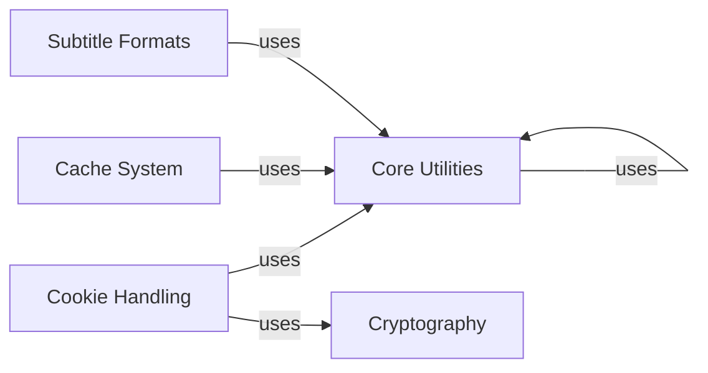

## Component Details

This graph illustrates the structure and interactions of core utility components within the yt-dlp application. It highlights how general-purpose helper functions, cryptographic operations, subtitle parsing, caching mechanisms, and cookie handling functionalities are organized and depend on each other to support the overall application's operations.

### Core Utilities
This component provides a collection of fundamental utility functions and classes used throughout yt-dlp. It includes general-purpose helpers for string manipulation, file system operations, process execution, error handling, and data formatting. It also encompasses networking-related utilities like HTTP header management and URL manipulation, as well as data traversal mechanisms and progress calculation tools. Compatibility functions for different Python versions or operating systems are also part of this component.

**Related Classes/Methods**:

- `yt_dlp.yt_dlp.utils._utils` (full file reference)
- `yt_dlp.yt_dlp.utils._utils:sanitize_path` (579:609)
- `yt_dlp.yt_dlp.utils._utils:bug_reports_message` (full file reference)
- `yt_dlp.yt_dlp.utils._utils:Namespace` (full file reference)
- `yt_dlp.yt_dlp.utils._utils:windows_enable_vt_mode` (full file reference)
- `yt_dlp.yt_dlp.utils._utils:supports_terminal_sequences` (full file reference)
- `yt_dlp.yt_dlp.utils._utils:Popen` (full file reference)
- `yt_dlp.yt_dlp.utils._utils:shell_quote` (full file reference)
- `yt_dlp.yt_dlp.utils._utils:DownloadError` (full file reference)
- `yt_dlp.yt_dlp.utils._utils:ExtractorError` (full file reference)
- `yt_dlp.yt_dlp.utils._utils:write_string` (full file reference)
- `yt_dlp.yt_dlp.utils._utils:deprecation_warning` (full file reference)
- `yt_dlp.yt_dlp.utils._utils:IDENTITY` (full file reference)
- `yt_dlp.yt_dlp.utils._utils:expand_path` (full file reference)
- `yt_dlp.yt_dlp.utils._utils:formatSeconds` (full file reference)
- `yt_dlp.yt_dlp.utils._utils:int_or_none` (full file reference)
- `yt_dlp.yt_dlp.utils._utils:float_or_none` (full file reference)
- `yt_dlp.yt_dlp.utils._utils:strftime_or_none` (full file reference)
- `yt_dlp.yt_dlp.utils._utils:sanitize_filename` (full file reference)
- `yt_dlp.yt_dlp.utils._utils:variadic` (full file reference)
- `yt_dlp.yt_dlp.utils._utils:format_decimal_suffix` (full file reference)
- `yt_dlp.yt_dlp.utils._utils:join_nonempty` (full file reference)
- `yt_dlp.yt_dlp.utils._utils:is_path_like` (full file reference)
- `yt_dlp.yt_dlp.utils._utils:locked_file` (full file reference)
- `yt_dlp.yt_dlp.utils._utils:try_call` (full file reference)
- `yt_dlp.yt_dlp.utils._utils:DateRange` (full file reference)
- `yt_dlp.yt_dlp.utils._utils:date_from_str` (full file reference)
- `yt_dlp.yt_dlp.utils._utils:age_restricted` (full file reference)
- `yt_dlp.yt_dlp.utils._utils:url_basename` (full file reference)
- `yt_dlp.yt_dlp.utils._utils:get_domain` (full file reference)
- `yt_dlp.yt_dlp.utils._utils:make_dir` (full file reference)
- `yt_dlp.yt_dlp.utils._utils:PlaylistEntries` (full file reference)
- `yt_dlp.yt_dlp.utils._utils:orderedSet` (full file reference)
- `yt_dlp.yt_dlp.utils._utils:parse_filesize` (full file reference)
- `yt_dlp.yt_dlp.utils._utils:str_or_none` (full file reference)
- `yt_dlp.yt_dlp.utils._utils:make_archive_id` (full file reference)
- `yt_dlp.yt_dlp.utils._utils:parse_duration` (full file reference)
- `yt_dlp.yt_dlp.utils._utils:parse_age_limit` (full file reference)
- `yt_dlp.yt_dlp.utils._utils:parse_count` (full file reference)
- `yt_dlp.yt_dlp.utils._utils:match_filter_func` (full file reference)
- `yt_dlp.yt_dlp.utils._utils:download_range_func` (full file reference)
- `yt_dlp.yt_dlp.utils._utils:ISO639Utils` (full file reference)
- `yt_dlp.yt_dlp.utils._utils:url_or_none` (full file reference)
- `yt_dlp.yt_dlp.utils._utils:determine_ext` (full file reference)
- `yt_dlp.yt_dlp.utils._utils:mimetype2ext` (full file reference)
- `yt_dlp.yt_dlp.utils._utils:unified_timestamp` (full file reference)
- `yt_dlp.yt_dlp.utils._utils:clean_html` (full file reference)
- `yt_dlp.yt_dlp.utils._utils:get_element_by_class` (full file reference)
- `yt_dlp.yt_dlp.utils._utils:get_element_html_by_class` (full file reference)
- `yt_dlp.yt_dlp.utils._utils:get_element_by_attribute` (full file reference)
- `yt_dlp.yt_dlp.utils._utils:get_element_html_by_attribute` (full file reference)
- `yt_dlp.yt_dlp.utils._utils:get_elements_by_class` (full file reference)
- `yt_dlp.yt_dlp.utils._utils:get_elements_html_by_class` (full file reference)
- `yt_dlp.yt_dlp.utils._utils:get_elements_by_attribute` (full file reference)
- `yt_dlp.yt_dlp.utils._utils:get_elements_html_by_attribute` (full file reference)
- `yt_dlp.yt_dlp.utils._utils:get_elements_text_and_html_by_attribute` (full file reference)
- `yt_dlp.yt_dlp.utils._utils:get_element_text_and_html_by_tag` (full file reference)
- `yt_dlp.yt_dlp.utils._utils:strip_or_none` (full file reference)
- `yt_dlp.yt_dlp.utils._utils:parse_iso8601` (full file reference)
- `yt_dlp.yt_dlp.utils._utils:urljoin` (full file reference)
- `yt_dlp.yt_dlp.utils._utils:parse_resolution` (full file reference)
- `yt_dlp.yt_dlp.utils._utils:qualities` (full file reference)
- `yt_dlp.yt_dlp.utils._utils:parse_qs` (full file reference)
- `yt_dlp.yt_dlp.utils._utils:update_url` (full file reference)
- `yt_dlp.yt_dlp.utils._utils:smuggle_url` (full file reference)
- `yt_dlp.yt_dlp.utils._utils:unsmuggle_url` (full file reference)
- `yt_dlp.yt_dlp.utils._utils:urlencode_postdata` (full file reference)
- `yt_dlp.yt_dlp.utils._utils:unescapeHTML` (full file reference)
- `yt_dlp.yt_dlp.utils._utils:filter_dict` (full file reference)
- `yt_dlp.yt_dlp.utils._utils:jwt_decode_hs256` (full file reference)
- `yt_dlp.yt_dlp.utils._utils:OnDemandPagedList` (full file reference)
- `yt_dlp.yt_dlp.utils._utils:base_url` (full file reference)
- `yt_dlp.yt_dlp.utils._utils:find_xpath_attr` (full file reference)
- `yt_dlp.yt_dlp.utils._utils:xpath_text` (full file reference)
- `yt_dlp.yt_dlp.utils._utils:xpath_element` (full file reference)
- `yt_dlp.yt_dlp.utils._utils:xpath_attr` (full file reference)
- `yt_dlp.yt_dlp.utils._utils:unified_strdate` (full file reference)
- `yt_dlp.yt_dlp.utils._utils:parse_codecs` (full file reference)
- `yt_dlp.yt_dlp.utils._utils:LazyList` (full file reference)
- `yt_dlp.yt_dlp.utils._utils:InAdvancePagedList` (full file reference)
- `yt_dlp.yt_dlp.utils._utils:truncate_string` (full file reference)
- `yt_dlp.yt_dlp.utils._utils:random_birthday` (full file reference)
- `yt_dlp.yt_dlp.utils._utils:random_ipv4` (full file reference)
- `yt_dlp.yt_dlp.utils._utils:clean_podcast_url` (full file reference)
- `yt_dlp.yt_dlp.utils._utils:datetime_from_str` (full file reference)
- `yt_dlp.yt_dlp.utils._utils:datetime_round` (full file reference)
- `yt_dlp.yt_dlp.utils._utils:jwt_encode_hs256` (full file reference)
- `yt_dlp.yt_dlp.utils._utils:parse_bitrate` (full file reference)
- `yt_dlp.yt_dlp.utils._utils:srt_subtitles_timecode` (full file reference)
- `yt_dlp.yt_dlp.utils._utils:ass_subtitles_timecode` (full file reference)
- `yt_dlp.yt_dlp.utils._utils:dfxp2srt` (full file reference)
- `yt_dlp.yt_dlp.utils._utils:cli_option` (full file reference)
- `yt_dlp.yt_dlp.utils._utils:cli_bool_option` (full file reference)
- `yt_dlp.yt_dlp.utils._utils:cli_valueless_option` (full file reference)
- `yt_dlp.yt_dlp.utils._utils:_configuration_args` (full file reference)
- `yt_dlp.yt_dlp.utils._utils:encode_base_n` (full file reference)
- `yt_dlp.yt_dlp.utils._utils:decode_base_n` (full file reference)
- `yt_dlp.yt_dlp.utils._utils:decode_packed_codes` (full file reference)
- `yt_dlp.yt_dlp.utils._utils:rot47` (full file reference)
- `yt_dlp.yt_dlp.utils._utils:write_xattr` (full file reference)
- `yt_dlp.yt_dlp.utils._utils:format_field` (full file reference)
- `yt_dlp.yt_dlp.utils._utils:get_executable_path` (full file reference)
- `yt_dlp.yt_dlp.utils._utils:get_user_config_dirs` (full file reference)
- `yt_dlp.yt_dlp.utils._utils:get_system_config_dirs` (full file reference)
- `yt_dlp.yt_dlp.utils._utils:scale_thumbnails_to_max_format_width` (full file reference)
- `yt_dlp.yt_dlp.utils._utils:parse_http_range` (full file reference)
- `yt_dlp.yt_dlp.utils._utils:read_stdin` (full file reference)
- `yt_dlp.yt_dlp.utils._utils:Config` (full file reference)
- `yt_dlp.yt_dlp.utils._utils:_UnsafeExtensionError` (full file reference)
- `yt_dlp.yt_dlp.utils._utils.RetryManager:report_retry` (full file reference)
- `yt_dlp.yt_dlp.utils._utils:orderedSet_from_options` (full file reference)
- `yt_dlp.yt_dlp.utils._utils.FormatSorter:evaluate_params` (full file reference)
- `yt_dlp.yt_dlp.utils._utils.FormatSorter:print_verbose_info` (full file reference)
- `yt_dlp.yt_dlp.utils._utils.FormatSorter:_calculate_field_preference_from_value` (full file reference)
- `yt_dlp.yt_dlp.utils._utils.FormatSorter:_calculate_field_preference` (full file reference)
- `yt_dlp.yt_dlp.utils._utils.FormatSorter:_fill_sorting_fields` (full file reference)
- `yt_dlp.yt_dlp.utils._utils.FormatSorter:calculate_preference` (full file reference)
- `yt_dlp.yt_dlp.utils._utils:_request_dump_filename` (full file reference)
- `yt_dlp.yt_dlp.utils.traversal` (full file reference)
- `yt_dlp.yt_dlp.utils.traversal:traverse_obj` (full file reference)
- `yt_dlp.yt_dlp.utils.traversal:require` (full file reference)
- `yt_dlp.yt_dlp.utils.traversal:subs_list_to_dict` (full file reference)
- `yt_dlp.yt_dlp.utils.traversal:find_element` (full file reference)
- `yt_dlp.yt_dlp.utils.traversal:get_first` (full file reference)
- `yt_dlp.yt_dlp.utils.traversal:dict_get` (full file reference)
- `yt_dlp.yt_dlp.utils.progress` (full file reference)
- `yt_dlp.yt_dlp.utils.progress.ProgressCalculator:__init__` (full file reference)
- `yt_dlp.yt_dlp.utils.progress.ProgressCalculator:update` (full file reference)
- `yt_dlp.yt_dlp.utils.progress.ProgressCalculator:_update` (full file reference)
- `yt_dlp.yt_dlp.utils.networking:HTTPHeaderDict` (full file reference)
- `yt_dlp.yt_dlp.utils.networking:clean_proxies` (full file reference)
- `yt_dlp.yt_dlp.utils.networking:normalize_url` (full file reference)
- `yt_dlp.yt_dlp.utils.networking:select_proxy` (full file reference)
- `yt_dlp.yt_dlp.compat.compat_utils` (full file reference)
- `yt_dlp.yt_dlp.compat.compat_utils:get_package_info` (full file reference)
- `yt_dlp.yt_dlp.compat.compat_utils.EnhancedModule:__getattribute__` (full file reference)
- `yt_dlp.yt_dlp.compat.compat_utils:passthrough_module` (full file reference)
- `yt_dlp.yt_dlp.compat:compat_etree_fromstring` (full file reference)
- `yt_dlp.yt_dlp.compat:urllib_req_to_req` (full file reference)
- `yt_dlp.yt_dlp.compat._deprecated:compat_shlex_quote` (full file reference)
- `yt_dlp.yt_dlp.utils._legacy.WebSocketsWrapper:__init__` (full file reference)
- `yt_dlp.yt_dlp.utils._legacy.WebSocketsWrapper:__enter__` (full file reference)
- `yt_dlp.yt_dlp.utils._legacy.WebSocketsWrapper:send` (full file reference)
- `yt_dlp.yt_dlp.utils._legacy.WebSocketsWrapper:recv` (full file reference)
- `yt_dlp.yt_dlp.utils._legacy.WebSocketsWrapper:__exit__` (full file reference)
- `yt_dlp.yt_dlp.utils._legacy:load_plugins` (full file reference)
- `yt_dlp.yt_dlp.utils._legacy:traverse_dict` (full file reference)
- `yt_dlp.yt_dlp.utils._legacy:decode_base` (full file reference)
- `yt_dlp.yt_dlp.utils._legacy:get_subprocess_encoding` (full file reference)
- `yt_dlp.yt_dlp.utils._legacy:decode_png` (full file reference)
- `yt_dlp.yt_dlp.utils._legacy:sanitized_Request` (full file reference)
- `yt_dlp.yt_dlp.utils._legacy.YoutubeDLHandler:__init__` (full file reference)
- `yt_dlp.yt_dlp.utils._legacy:make_HTTPS_handler` (full file reference)
- `yt_dlp.yt_dlp.utils._legacy:process_communicate_or_kill` (full file reference)
- `yt_dlp.yt_dlp.utils._legacy:decodeOption` (full file reference)

### Cryptography
This component handles various cryptographic operations, primarily focusing on AES encryption and decryption algorithms. It provides functions for different AES modes like ECB, CTR, and CBC, along with key expansion and related utility functions for secure data handling.

**Related Classes/Methods**:

- `yt_dlp.yt_dlp.aes` (full file reference)
- `yt_dlp.yt_dlp.aes:unpad_pkcs7` (full file reference)
- `yt_dlp.yt_dlp.aes:aes_ecb_encrypt` (full file reference)
- `yt_dlp.yt_dlp.aes:aes_ecb_decrypt` (full file reference)
- `yt_dlp.yt_dlp.aes:aes_ctr_encrypt` (full file reference)
- `yt_dlp.yt_dlp.aes:aes_cbc_decrypt` (full file reference)
- `yt_dlp.yt_dlp.aes:aes_cbc_encrypt` (full file reference)
- `yt_dlp.yt_dlp.aes:aes_gcm_decrypt_and_verify` (full file reference)
- `yt_dlp.yt_dlp.aes:aes_encrypt` (full file reference)
- `yt_dlp.yt_dlp.aes:aes_decrypt` (full file reference)
- `yt_dlp.yt_dlp.aes:aes_decrypt_text` (full file reference)
- `yt_dlp.yt_dlp.aes:key_expansion` (full file reference)
- `yt_dlp.yt_dlp.aes:iter_vector` (full file reference)
- `yt_dlp.yt_dlp.aes:key_schedule_core` (full file reference)
- `yt_dlp.yt_dlp.aes:block_product` (full file reference)
- `yt_dlp.yt_dlp.aes:ghash` (full file reference)
- `yt_dlp.yt_dlp.aes:aes_cbc_encrypt_bytes` (full file reference)
- `yt_dlp.yt_dlp.aes:aes_ctr_decrypt` (full file reference)
- `yt_dlp.yt_dlp.aes:aes_gcm_decrypt_and_verify_bytes` (full file reference)

### Subtitle Formats
This component is responsible for parsing and formatting subtitle data, specifically focusing on WebVTT (Web Video Text Tracks) format. It includes classes and functions to handle timestamp parsing, cue block management, and writing subtitle information into various outputs.

**Related Classes/Methods**:

- `yt_dlp.yt_dlp.webvtt` (full file reference)
- `yt_dlp.yt_dlp.webvtt:_format_ts` (full file reference)
- `yt_dlp.yt_dlp.webvtt.Magic:__parse_tsmap` (full file reference)
- `yt_dlp.yt_dlp.webvtt.Magic:parse` (full file reference)
- `yt_dlp.yt_dlp.webvtt.Magic:write_into` (full file reference)
- `yt_dlp.yt_dlp.webvtt.CueBlock:parse` (full file reference)
- `yt_dlp.yt_dlp.webvtt.CueBlock:write_into` (full file reference)
- `yt_dlp.yt_dlp.webvtt.CueBlock:from_json` (full file reference)
- `yt_dlp.yt_dlp.webvtt:parse_fragment` (full file reference)

### Cache System
This component provides a caching mechanism for yt-dlp, allowing it to store and retrieve data to improve performance and reduce redundant operations. It handles cache file management, including storing, loading, and removing cached data.

**Related Classes/Methods**:

- `yt_dlp.yt_dlp.cache.Cache` (full file reference)
- `yt_dlp.yt_dlp.cache.Cache:__init__` (full file reference)
- `yt_dlp.yt_dlp.cache.Cache:_get_root_dir` (full file reference)
- `yt_dlp.yt_dlp.cache.Cache:_get_cache_fn` (full file reference)
- `yt_dlp.yt_dlp.cache.Cache:store` (full file reference)
- `yt_dlp.yt_dlp.cache.Cache:_validate` (full file reference)
- `yt_dlp.yt_dlp.cache.Cache:load` (full file reference)
- `yt_dlp.yt_dlp.cache.Cache:remove` (full file reference)

### Cookie Handling
This component manages browser cookies for authentication and session persistence. It provides functionalities to load cookies from various browser formats (Firefox, Chrome, Safari), save them, and retrieve them for network requests. It also includes platform-specific decryption logic for secure cookie storage.

**Related Classes/Methods**:

- `yt_dlp.yt_dlp.cookies.YoutubeDLCookieJar:save` (full file reference)
- `yt_dlp.yt_dlp.cookies.YoutubeDLCookieJar:load` (full file reference)
- `yt_dlp.yt_dlp.cookies.YoutubeDLCookieJar:get_cookie_header` (full file reference)
- `yt_dlp.yt_dlp.cookies.YoutubeDLCookieJar:get_cookies_for_url` (full file reference)
- `yt_dlp.yt_dlp.cookies.YoutubeDLCookieJar:__init__` (full file reference)
- `yt_dlp.yt_dlp.cookies.YoutubeDLCookieJar:open` (full file reference)
- `yt_dlp.yt_dlp.cookies.YoutubeDLCookieJar:_really_save` (full file reference)
- `yt_dlp.yt_dlp.cookies.YDLLogger:warning` (full file reference)
- `yt_dlp.yt_dlp.cookies.YDLLogger:progress_bar` (full file reference)
- `yt_dlp.yt_dlp.cookies:_create_progress_bar` (full file reference)
- `yt_dlp.yt_dlp.cookies:load_cookies` (full file reference)
- `yt_dlp.yt_dlp.cookies:extract_cookies_from_browser` (full file reference)
- `yt_dlp.yt_dlp.cookies:_extract_firefox_cookies` (full file reference)
- `yt_dlp.yt_dlp.cookies:_get_chromium_based_browser_settings` (full file reference)
- `yt_dlp.yt_dlp.cookies:_extract_chrome_cookies` (full file reference)
- `yt_dlp.yt_dlp.cookies:get_cookie_decryptor` (full file reference)
- `yt_dlp.yt_dlp.cookies.LinuxChromeCookieDecryptor:__init__` (full file reference)
- `yt_dlp.yt_dlp.cookies.LinuxChromeCookieDecryptor:_v11_key` (full file reference)
- `yt_dlp.yt_dlp.cookies.LinuxChromeCookieDecryptor:derive_key` (full file reference)
- `yt_dlp.yt_dlp.cookies.LinuxChromeCookieDecryptor:decrypt` (full file reference)
- `yt_dlp.yt_dlp.cookies.MacChromeCookieDecryptor:__init__` (full file reference)
- `yt_dlp.yt_dlp.cookies.MacChromeCookieDecryptor:derive_key` (full file reference)
- `yt_dlp.yt_dlp.cookies.MacChromeCookieDecryptor:decrypt` (full file reference)
- `yt_dlp.yt_dlp.cookies.WindowsChromeCookieDecryptor:__init__` (full file reference)
- `yt_dlp.yt_dlp.cookies.WindowsChromeCookieDecryptor:decrypt` (full file reference)
- `yt_dlp.yt_dlp.cookies:_extract_safari_cookies` (full file reference)
- `yt_dlp.yt_dlp.cookies.DataParser:read_bytes` (full file reference)
- `yt_dlp.yt_dlp.cookies.DataParser:expect_bytes` (full file reference)
- `yt_dlp.yt_dlp.cookies.DataParser:read_uint` (full file reference)
- `yt_dlp.yt_dlp.cookies.DataParser:read_double` (full file reference)
- `yt_dlp.yt_dlp.cookies.DataParser:read_cstring` (full file reference)
- `yt_dlp.yt_dlp.cookies.DataParser:skip` (full file reference)
- `yt_dlp.yt_dlp.cookies.DataParser:skip_to` (full file reference)
- `yt_dlp.yt_dlp.cookies.DataParser:skip_to_end` (full file reference)
- `yt_dlp.yt_dlp.cookies:_parse_safari_cookies_header` (full file reference)
- `yt_dlp.yt_dlp.cookies:_parse_safari_cookies_page` (full file reference)
- `yt_dlp.yt_dlp.cookies:_parse_safari_cookies_record` (full file reference)
- `yt_dlp.yt_dlp.cookies:parse_safari_cookies` (full file reference)
- `yt_dlp.yt_dlp.cookies:_choose_linux_keyring` (full file reference)
- `yt_dlp.yt_dlp.cookies:_get_kwallet_network_wallet` (full file reference)
- `yt_dlp.yt_dlp.cookies:_get_kwallet_password` (full file reference)
- `yt_dlp.yt_dlp.cookies:_get_linux_keyring_password` (full file reference)
- `yt_dlp.yt_dlp.cookies:_get_mac_keyring_password` (full file reference)
- `yt_dlp.yt_dlp.cookies:_get_windows_v10_key` (full file reference)
- `yt_dlp.yt_dlp.cookies:_decrypt_aes_cbc_multi` (full file reference)
- `yt_dlp.yt_dlp.cookies:_decrypt_aes_gcm` (full file reference)
- `yt_dlp.yt_dlp.cookies:_decrypt_windows_dpapi` (full file reference)
- `yt_dlp.yt_dlp.cookies:_find_files` (full file reference)
- `yt_dlp.yt_dlp.cookies:_merge_cookie_jars` (full file reference)
- `yt_dlp.yt_dlp.cookies:_parse_browser_specification` (full file reference)

### [FAQ](https://github.com/CodeBoarding/GeneratedOnBoardings/tree/main?tab=readme-ov-file#faq)