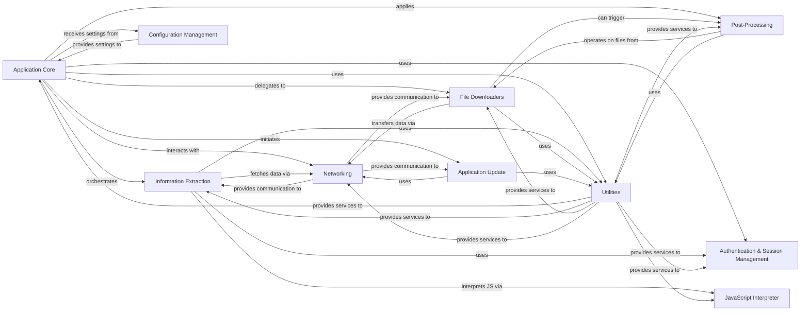

## Component Details

The yt-dlp application architecture is centered around an Application Core that orchestrates the entire media download process. This core component interacts with specialized modules for Information Extraction from various online sources, delegates the actual media fetching to File Downloaders, and applies Post-Processing steps for format conversion and metadata management. Network communication is handled by a dedicated Networking layer, while common functionalities like data parsing, error handling, caching, and cryptography are provided by a comprehensive Utilities component. User authentication and session persistence are managed by the Authentication & Session Management module, and a JavaScript Interpreter is used for dynamic content extraction. Application settings are handled by Configuration Management, and the system includes an Application Update mechanism for self-maintenance.

### Application Core
The primary entry point and high-level control flow of the yt-dlp application. It orchestrates the entire download process, including parsing global options, initiating information extraction, managing file downloading, applying post-processors, and handling overall application lifecycle and error reporting.

**Related Classes/Methods**:

- `yt_dlp.__main__` (full file reference)
- `yt_dlp.yt_dlp.YoutubeDL` (full file reference)
- `yt_dlp.yt_dlp.YoutubeDL:extract_info` (686:718)
- `yt_dlp.yt_dlp.YoutubeDL:download` (1308:1320)

### Information Extraction
A comprehensive component responsible for identifying and parsing video/audio metadata and stream URLs from various online sources, often involving website-specific logic. It interacts with the network to fetch web pages and may interpret JavaScript. Includes specialized components for platforms like YouTube's Proof-of-Trust system.

**Related Classes/Methods**:

- `yt_dlp.yt_dlp.extractor.common.InfoExtractor` (full file reference)
- `yt_dlp.yt_dlp.extractor.common.InfoExtractor:_real_extract` (293:295)
- `yt_dlp.yt_dlp.extractor.youtube.pot._director.PoTokenRequestDirector` (full file reference)

### File Downloaders
Handles the low-level mechanics of fetching media data from URLs, supporting various protocols and external tools. It manages progress reporting, retries, and temporary files.

**Related Classes/Methods**:

- `yt_dlp.yt_dlp.downloader.common.FileDownloader` (full file reference)
- `yt_dlp.yt_dlp.downloader.common.FileDownloader:download` (236:269)
- `yt_dlp.yt_dlp.downloader.http.HttpFD` (full file reference)
- `yt_dlp.yt_dlp.downloader.hls.HlsFD` (full file reference)
- `yt_dlp.yt_dlp.downloader.external.ExternalFD` (full file reference)

### Post-Processing
A suite of tools for manipulating downloaded media, including format conversion, metadata embedding, and chapter management, often leveraging external binaries like FFmpeg.

**Related Classes/Methods**:

- `yt_dlp.yt_dlp.postprocessor.common.PostProcessor` (full file reference)
- `yt_dlp.yt_dlp.postprocessor.common.PostProcessor:run` (109:112)
- `yt_dlp.yt_dlp.postprocessor.ffmpeg.FFmpegPostProcessor` (full file reference)

### Networking
Manages all aspects of network communication, including creating and sending HTTP/HTTPS requests, handling responses, and managing proxies (including SOCKS) and SSL contexts.

**Related Classes/Methods**:

- `yt_dlp.yt_dlp.networking.common.RequestDirector` (full file reference)
- `yt_dlp.yt_dlp.networking.common.RequestDirector:send` (78:109)
- `yt_dlp.yt_dlp.networking.common.RequestHandler` (full file reference)
- `yt_dlp.yt_dlp.networking._urllib.UrllibRH` (full file reference)
- `yt_dlp.yt_dlp.networking._requests.RequestsRH` (full file reference)
- `yt_dlp.yt_dlp.socks.sockssocket` (full file reference)

### Utilities
A collection of general-purpose helper functions and classes used across the application for tasks such as string manipulation, file system operations, data parsing, error handling, caching, cryptographic operations, and compatibility adjustments.

**Related Classes/Methods**:

- `yt_dlp.yt_dlp.utils._utils` (full file reference)
- `yt_dlp.yt_dlp.utils._utils:sanitize_path` (579:609)
- `yt_dlp.yt_dlp.utils.traversal` (full file reference)
- `yt_dlp.yt_dlp.utils.progress` (full file reference)
- `yt_dlp.yt_dlp.cache.Cache` (full file reference)
- `yt_dlp.yt_dlp.aes` (full file reference)
- `yt_dlp.yt_dlp.webvtt` (full file reference)
- `yt_dlp.yt_dlp.compat.compat_utils` (full file reference)

### Authentication & Session Management
Manages user login sessions, including handling credentials from various sources (e.g., netrc, browser cookies) and maintaining cookie jars for persistent sessions.

**Related Classes/Methods**:

- `yt_dlp.yt_dlp.cookies.YoutubeDLCookieJar` (full file reference)
- `yt_dlp.yt_dlp.cookies.load_cookies` (105:110)

### JavaScript Interpreter
Provides a lightweight, custom JavaScript interpreter used by Information Extraction modules to execute obfuscated JavaScript code, typically for signature decryption or dynamic data extraction from web pages.

**Related Classes/Methods**:

- `yt_dlp.yt_dlp.jsinterp.JSInterpreter` (full file reference)

### Configuration Management
Responsible for parsing command-line arguments, loading and merging configuration files from various locations, and managing application-wide settings and options.

**Related Classes/Methods**:

- `yt_dlp.yt_dlp.options:parseOpts` (23:68)
- `yt_dlp.yt_dlp.options:create_parser` (160:868)

### Application Update
Manages the self-update mechanism of the yt-dlp application, including checking for new versions, downloading updates from official repositories, and replacing the executable.

**Related Classes/Methods**:

- `yt_dlp.yt_dlp.update.Updater` (full file reference)
- `yt_dlp.yt_dlp.update.Updater:update` (289:358)

### [FAQ](https://github.com/CodeBoarding/GeneratedOnBoardings/tree/main?tab=readme-ov-file#faq)