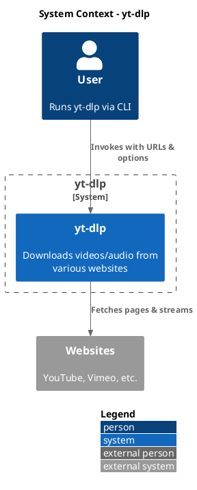
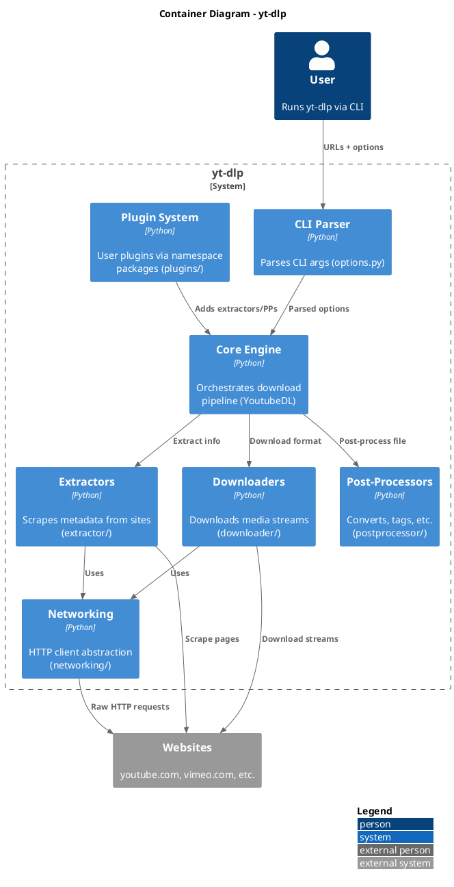
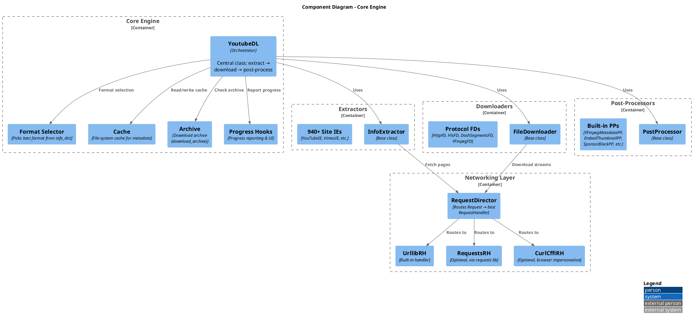
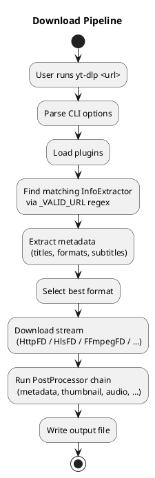

# yt-dlp Architecture (C4 Model)

## System Context (Level 1)

```plantuml
@startuml
!include <C4/C4_Context>

LAYOUT_WITH_LEGEND()

title System Context - yt-dlp

Person(user, "User", "Runs yt-dlp via CLI")

System_Boundary(ytdlp, "yt-dlp") {
  System(ytdlp_sys, "yt-dlp", "Downloads videos/audio from various websites")
}

System_Ext(sites, "Websites", "YouTube, Vimeo, etc.")

Rel(user, ytdlp_sys, "Invokes with URLs & options")
Rel(ytdlp_sys, sites, "Fetches pages & streams")

@enduml
```

## Container Diagram (Level 2)

```plantuml
@startuml
!include <C4/C4_Container>
!include <C4/C4_Context>

LAYOUT_WITH_LEGEND()

title Container Diagram - yt-dlp

Person(user, "User", "Runs yt-dlp via CLI")

System_Boundary(ytdlp, "yt-dlp") {
  Container(cli, "CLI Parser", "Python", "Parses CLI args (options.py)")
  Container(core, "Core Engine", "Python", "Orchestrates download pipeline (YoutubeDL)")
  Container(ext, "Extractors", "Python", "Scrapes metadata from sites (extractor/)")
  Container(dl, "Downloaders", "Python", "Downloads media streams (downloader/)")
  Container(pp, "Post-Processors", "Python", "Converts, tags, etc. (postprocessor/)")
  Container(net, "Networking", "Python", "HTTP client abstraction (networking/)")
  Container(plugins, "Plugin System", "Python", "User plugins via namespace packages (plugins/)")
}

System_Ext(sites, "Websites", "youtube.com, vimeo.com, etc.")

Rel(user, cli, "URLs + options")
Rel(cli, core, "Parsed options")
Rel(core, ext, "Extract info")
Rel(core, dl, "Download format")
Rel(core, pp, "Post-process file")
Rel(ext, sites, "Scrape pages")
Rel(dl, sites, "Download streams")
Rel(net, sites, "Raw HTTP requests")
Rel(ext, net, "Uses")
Rel(dl, net, "Uses")
Rel(plugins, core, "Adds extractors/PPs")

@enduml
```

## Component Diagram (Level 3) — Core Engine

```plantuml
@startuml
!include <C4/C4_Component>
!include <C4/C4_Context>

LAYOUT_WITH_LEGEND()

title Component Diagram - Core Engine

Container_Boundary(core, "Core Engine") {
  Component(ydl, "YoutubeDL", "Orchestrator", "Central class: extract → download → post-process")
  Component(fmt, "Format Selector", "Picks best format from info_dict")
  Component(cache, "Cache", "File-system cache for metadata")
  Component(archive, "Archive", "Download archive (download_archive)")
  Component(hook, "Progress Hooks", "Progress reporting & UI")
}

Container_Boundary(ext, "Extractors") {
  Component(ie_base, "InfoExtractor", "Base class")
  Component(ie_list, "940+ Site IEs", "YouTubeIE, VimeoIE, etc.")
}

Container_Boundary(dl, "Downloaders") {
  Component(fd_base, "FileDownloader", "Base class")
  Component(fd_list, "Protocol FDs", "HttpFD, HlsFD, DashSegmentsFD, FFmpegFD")
}

Container_Boundary(pp, "Post-Processors") {
  Component(pp_base, "PostProcessor", "Base class")
  Component(pp_list, "Built-in PPs", "FFmpegMetadataPP, EmbedThumbnailPP, SponsorBlockPP, etc.")
}

Container_Boundary(net, "Networking Layer") {
  Component(director, "RequestDirector", "Routes Request → best RequestHandler")
  Component(rh_urllib, "UrllibRH", "Built-in handler")
  Component(rh_requests, "RequestsRH", "Optional, via requests lib")
  Component(rh_curl, "CurlCffiRH", "Optional, browser impersonation")
}

Rel(ydl, ie_base, "Uses")
Rel(ydl, fd_base, "Uses")
Rel(ydl, pp_base, "Uses")
Rel(ydl, fmt, "Format selection")
Rel(ydl, cache, "Read/write cache")
Rel(ydl, archive, "Check archive")
Rel(ydl, hook, "Report progress")

Rel(ie_base, director, "Fetch pages")
Rel(fd_base, director, "Download streams")
Rel(director, rh_urllib, "Routes to")
Rel(director, rh_requests, "Routes to")
Rel(director, rh_curl, "Routes to")

@enduml
```

## Pipeline Flow

```plantuml
@startuml
title Download Pipeline

start
:User runs yt-dlp <url>;
:Parse CLI options;
:Load plugins;
:Find matching InfoExtractor
 via _VALID_URL regex;
:Extract metadata
 (titles, formats, subtitles);
:Select best format;
:Download stream
 (HttpFD / HlsFD / FFmpegFD / ...);
:Run PostProcessor chain
 (metadata, thumbnail, audio, ...);
:Write output file;
stop

@enduml
```
